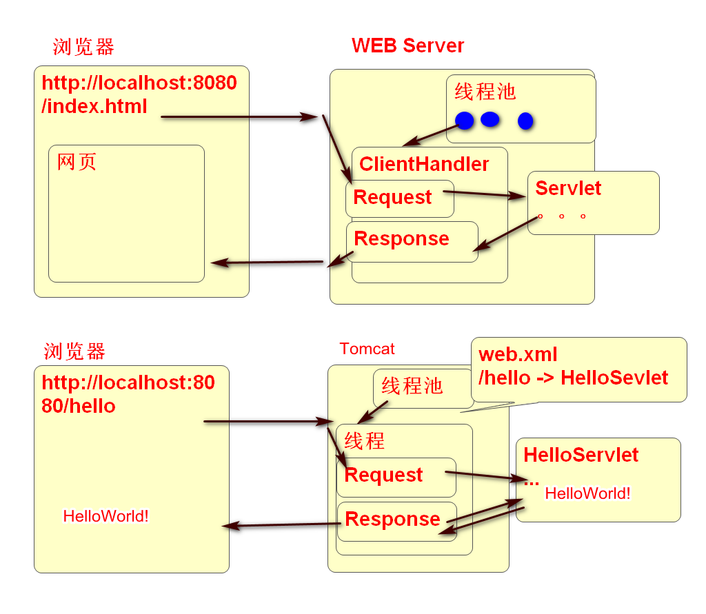

- [Servlet/JSP](#Servlet/JSP)
    - [Tomcat Web 服务器](#Tomcat-Web-服务器)
        - [使用Tomcat](#使用tomcat)
        - [Serlvet Hello World](#serlvet-hello-world)
            - [案例1 使用Servlet接口创建Servlet](#案例1-使用servlet接口创建servlet)
    - [HttpServlet](#httpservlet)
        - [使用GenericServlet创建Servlet](#使用genericservlet创建servlet)
            - [案例2 相对于实现Servlet接口 继承Generic是更简单的方式](#案例2-相对于实现Servlet接口-继承Generic是更简单的方式)
        - [使用 HttpServlet创建Servlet](#使用-httpservlet创建servlet)
            - [案例3 继承 HttpServlet，比实现Servlet接口简单](#案例3-继承HttpServlet比实现Servlet接口简单)
            - [案例4 利用网页处理get请求](#案例4-利用网页处理get请求)
            - [案例5 利用HttpServlet处理post请求](#案例5-利用httpservlet处理post请求)
            - [案例6 既能处理get也能处理post请求的Servlet](#案例6-既能处理get也能处理post请求的servlet)
    - [HttpServletRequest](#httpservletrequest) 
            - [案例7 利用Request获取请求信息](#案例7-利用request获取请求信息)
    - [HttpServletResponse](#httpservletresponse) 
            - [案例8 利于Response对象向客户端发送信息](#案例8-利于response对象向客户端发送信息)

# Servlet/JSP

## Tomcat Web 服务器

Tomcat 是一个现成Web服务器，其将HTTP通信功能都实现了，使用Tomcat只需要编写简单的Servlet就可以处理HTTP编程。

原理：

### 使用Tomcat 

1. 下载 Tomcat apache-tomcat-7.0.93.zip
	- http://tomcat.apache.org
2. 释放到硬盘上
	1. Windows释放到 D:/apache-tomcat-7.0.93
	2. Linux 释放到 /home/soft01/apache-tomcat-7.0.93
3. 在Eclipse中配置使用Tomcat
4. 启动Tomcat查看 http://localhost:8080

### Serlvet Hello World

Servlet是Oralce(SUN)定义的开发规范：

1. 固定的目录结构
	
		webapp
		  |-- WEB-INF
		  |   |-- web.xml  (部署描述文件)配置请求与Serlvet的映射关系 
		  |   |              /hello -> day01.HelloServlet
		  |   |-- lib      放置第三方的库 如：数据库驱动程序等
		  |   |-- classes  放置自己写的，编译后的类
		  |   |    |-- day01.HelloServlet.class
		  |-- index.html
		  |-- logo.png

2. 固定的接口名
	1. Servlet 接口
	2. HelloServlet 类必须实现Servlet接口（还可以继承HttpServlet）

3. 固定的配置文件规则 web.xml 
	
		<servlet>
			<servlet-name>hello</servlet-name>
			<servlet-class>day01.HelloServlet</servlet-class>
		</servlet>
		<servlet-mapping>
			<servlet-name>hello</servlet-name>
			<url-pattern>/hello</url-pattern>
		</servlet-mapping>  
	url请求hello时,去找与其name对应的接口的类名(class)

4. 将应用程序部署（复制）到Tomcat中
- Server -> Add and Remove 

**使用Maven项目创建Web项目步骤：**
	在JAVA EE视图中
1. 创建Maven项目，选择**war**方式 // 自动创建目录结构
2. 利用右键菜单生成部署描述文件(Deplyment Description - Generate Deployment Descriptor Stub)
3. 导入 Targeted Runtimes // 导入接口(Tomcat-Servlet)
4. 创建Servlet类
5. 部署测试

#### 案例1 使用Servlet接口创建Servlet

1. 创建类

		public class HelloServlet implements Servlet{
			// Servlet内的方法
			public void init(ServletConfig cfg)	throws ServletException {
			}
			public void destroy() {
			}
			public ServletConfig getServletConfig() {
				return null;
			}
			public String getServletInfo() {
				return null;
			}
			// request代表用户发的请求信息,把发给用户的信息写到response
			public void service(ServletRequest req, ServletResponse res)throws ServletException, IOException {
				// 用户接受的是一个网页
				res.setContentType("text/html");
				PrintWriter out=res.getWriter();
				out.println("<html><body><h1>Hello World</h1></body></html>");
			}
		}

2. 配置web.xml
		
		  <servlet>
		    <servlet-name>hello</servlet-name>
		    <servlet-class>day01.HelloServlet</servlet-class>
		  </servlet>
		  <servlet-mapping>
		    <servlet-name>hello</servlet-name>
		    <url-pattern>/hello</url-pattern>
		  </servlet-mapping>

3. 部署测试：
	1. 部署
		Add and Remove
	2. 测试
		http://localhost:8080/Servlet01/hello

## HttpServlet

实现Servlet接口(init etc)：

1. 直接Servlet接口编程繁琐(完全的空接口)
2. Servlet 接口有两个实现类
	1. GenericServlet: 实现了全部方法
	2. HttpServlet: 实现了全部方法,分清了get/post请求
3. 实现 HttpServlet 更加简便
4. HttpServlet区分了Http请求类型
	1. get 请求被doGet方法处理
	2. post 请求被doPost处理
	3. doGet方法中调用一下doPost，就可以一起处理get和Post

### 使用GenericServlet创建Servlet 

#### 案例2 相对于实现Servlet接口 继承Generic是更简单的方式

1. 编写类

		public class DemoServlet extends GenericServlet{
			public void service(ServletRequest req, ServletResponse res)throws ServletException, IOException {
				res.setContentType("text/html");
				PrintWriter out = res.getWriter();
				out.print("HI GenericServlet"); 
			}
		}

2. 配置 web.xml

		  <servlet>
		    <servlet-name>demo1</servlet-name>
		    <servlet-class>day01.DemoServlet</servlet-class>
		  </servlet>
		  <servlet-mapping>
		    <servlet-name>demo1</servlet-name>
		    <url-pattern>/demo1</url-pattern>
		  </servlet-mapping>

3. 部署测试

### 使用 HttpServlet创建Servlet
	
#### 案例3 继承HttpServlet比实现Servlet接口简单
	相比 GenericServlet 可以区别 get、post请求  
	重写 doGet 就是处理 get 请求
	 get请求： 浏览器地址栏直接请求是get请求
	          a标签连接请求是get请求 // 点击超链接,请求跳转
	          img标签中的src是get请求 
	重写 doPost 就是处理 post 请求
	 post请求： 表单method=post时候的请求

1. 创建类

		public class TestServlet extends HttpServlet {
			
			@Override
			protected void doGet(HttpServletRequest req, HttpServletResponse resp) throws ServletException, IOException {
				resp.setContentType("text/html");
				PrintWriter out=resp.getWriter();
				out.println("HI HttpServlet doGet()"); 
			}
		}

2. 配置 web.xml
		
		  <servlet>
		    <servlet-name>demo2</servlet-name>
		    <servlet-class>day01.TestServlet</servlet-class>
		  </servlet>
		  <servlet-mapping>
		    <servlet-name>demo2</servlet-name>
		    <url-pattern>/demo2</url-pattern>
		  </servlet-mapping>

3. 测试

#### 案例4 利用网页处理get请求

1. 编写网页 webapp/demo.html

		<!DOCTYPE html>
		<html>
		<head>
		<meta charset="UTF-8">
		<title>Insert title here</title>
		</head>
		<body>
			<h1>测试get请求</h1>
			<a href="demo2">test</a>

			<h1>测试post请求</h1>
			
客户端向服务器发起post请求，但是服务器只能处理get请求，此时服务器端会出现 405错误！

			<form action="demo2" method="post">
				<input type="submit" value="GO">  
			</form>		
		</body>
		</html>

2. 测试

#### 案例5 利用HttpServlet处理post请求

1. 编写Servlet类

		/**
		 * 处理Post请求，就需要重写doPost方法
		 */
		public class DoPostServlet extends HttpServlet{
			
			@Override
			protected void doPost(HttpServletRequest req, 
					HttpServletResponse resp) 
				throws ServletException, IOException {
				resp.setContentType("text/html");
				PrintWriter out = resp.getWriter();
				out.println("Hi doPost"); 
			}
		
		}

2. 配置

		  <servlet>
		    <servlet-name>demo3</servlet-name>
		    <servlet-class>day01.DoPostServlet</servlet-class>
		  </servlet>
		  <servlet-mapping>
		    <servlet-name>demo3</servlet-name>
		    <url-pattern>/demo3</url-pattern>
		  </servlet-mapping>

3. 编写网页
	
		
正确处理post请求案例

		<form action="demo3" method="post">
			<input type="submit" value="GO">  
		</form>
	
4. 测试

#### 案例6 既能处理get也能处理post请求的Servlet

1. 编写Servlet

		/**
		 * 既能处理get请求也能处理post请求 
		 * 1. get请求-> doGet() -> doPost()
		 * 2. post请求 -> doPost() 
		 */
		public class GetPostServlet extends HttpServlet{
			
			@Override
			protected void doGet(HttpServletRequest req, HttpServletResponse resp) throws ServletException, IOException {
				doPost(req, resp); 
			}
			
			@Override
			protected void doPost(HttpServletRequest req, HttpServletResponse resp) throws ServletException, IOException {
				resp.setContentType("text/html");
				PrintWriter out=resp.getWriter();
				out.print("get & post"); 
			}
		}

2. 配置

		  <servlet>
		    <servlet-name>demo4</servlet-name>
		    <servlet-class>day01.GetPostServlet</servlet-class>
		  </servlet>
		  <servlet-mapping>
		    <servlet-name>demo4</servlet-name>
		    <url-pattern>/demo4</url-pattern>
		  </servlet-mapping>

3. 编写 html

		
即能处理get也能处理post请求

		<a href="demo4">test</a>
		<form action="demo4" method="post">
			<input type="submit" value="GO">  
		</form>

4. 测试

## HttpServletRequest

客户端浏览器发起的请求消息，经过Tomcat解析以后，封装到Request对象中。

利用Request提供API可以获取请求中的信息。

#### 案例7 利用Request获取请求信息
	 演示 Request 对象的功能, Request 代表用户浏览器发送的请求信息

1. 编写Servlet

		public class RequestDemoServlet extends HttpServlet {
			private static final long serialVersionUID = 1L;
		
			protected void doGet(HttpServletRequest request, HttpServletResponse response) throws ServletException, IOException {
				//读取请求行上的 Method 信息
				String method=request.getMethod();
				//读取请求行上的 Request-URI
				String uri = request.getRequestURI();
				//读取请求行上的协议版本
				String protocol = request.getProtocol();
				
				//读取请求头信息 
				// User-Agent 用户代理，就是浏览器的信息, 类型版本等 
				// 获取请求头中的用户浏览器相关信息
				String ua=request.getHeader("User-Agent");
				String host = request.getHeader("Host");
				
				//设置服务器发送端的编码规则
				//response.setCharacterEncoding("UTF-8");
				//设置浏览器接收时候的解码规则
				response.setContentType("text/html; charset=UTF-8");
				
				//设置 contentType 时候，response会自动设置CharacterEncoding
				
				PrintWriter out = response.getWriter();
				out.print("<html>");
				out.print("<body>");
				out.print("<ul>");
				out.print("<li>"+method+"</li>");
				out.print("<li>"+uri+"</li>");
				out.print("<li>"+protocol+"</li>");
				out.print("<li>"+ua+"</li>");
				out.print("<li>"+host+"</li>");
				out.print("<li>试试</li>");
				out.print("</ul>");
				out.print("</body>");
				out.print("</html>");
			}
		}

2. 配置

		  <servlet>
		    <description></description>
		    <display-name>RequestDemoServlet</display-name>
		    <servlet-name>RequestDemoServlet</servlet-name>
		    <servlet-class>day01.RequestDemoServlet</servlet-class>
		  </servlet>
		  <servlet-mapping>
		    <servlet-name>RequestDemoServlet</servlet-name>
		    <url-pattern>/reqdemo</url-pattern>
		  </servlet-mapping>

3. 测试

## HttpServletResponse

	Response对象代表服务器向客户端发送的信息

#### 案例8 利于Response对象向客户端发送信息

1. Servlet类
		
		public class ResponseDemoServlet extends HttpServlet {
			private static final long serialVersionUID = 1L;
		       
			protected void doGet(HttpServletRequest request, HttpServletResponse response) throws ServletException, IOException {
				//设置响应行状态码
				response.setStatus(404); 
				//添加一个自定义的响应消息头：
				response.addHeader("Demo", "Hello World!"); 
				response.setContentType("text/html; charset=UTF-8");
				//一定在设置编码以后，获取out对象！！否则有编码错误
				PrintWriter out = response.getWriter();
				//设置响应的实体Body
				out.println("<html>");
				out.println("<body>");
				out.println("<h1>404，没有找到妹子呀！</h1>");
				out.println("</body>");
				out.println("</html>");
			}
		
		}
		
2. 配置

		  <servlet>
		    <description></description>
		    <display-name>ResponseDemoServlet</display-name>
		    <servlet-name>ResponseDemoServlet</servlet-name>
		    <servlet-class>day01.ResponseDemoServlet</servlet-class>
		  </servlet>
		  <servlet-mapping>
		    <servlet-name>ResponseDemoServlet</servlet-name>
		    <url-pattern>/respdemo</url-pattern>
		  </servlet-mapping>

3. 测试
