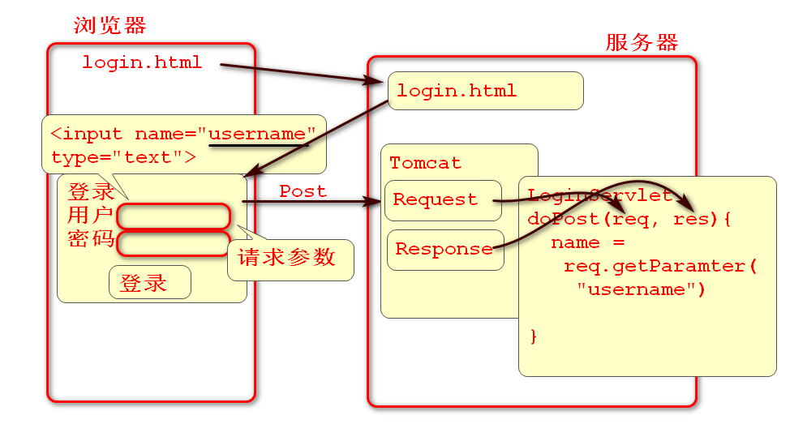
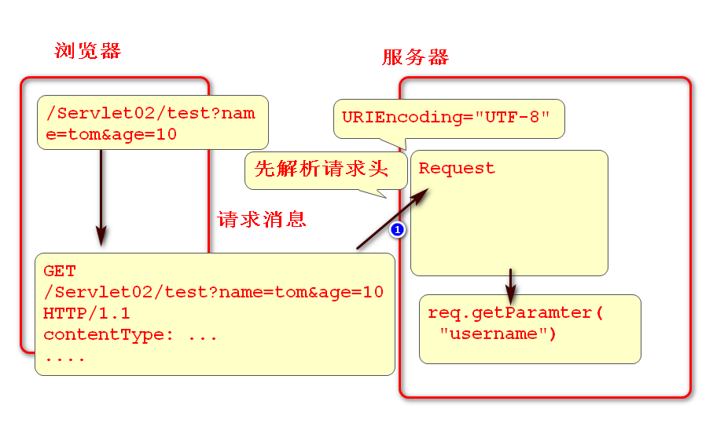

<!-- TOC -->
- [Sertlet](#sertlet)
    - [处理请求参数 getParameter](#处理请求参数-getParameter)<BR>
            - [案例: 获取post请求](#案例-获取post请求)<BR>
            - [案例: 获取get请求](#案例-获取get请求)<BR>
    - [处理多选(数组)参数 getParameterValues](#处理多选数组参数-getparametervalues)<BR>
            - [案例](#案例)
    - [在Servlet中使用JDBC](#在servlet中使用jdbc)<BR>
            - [案例](#案例-1)
    - [利用DAO封装数据库访问](#利用dao封装数据库访问)
<!-- /TOC -->

# Sertlet

## 处理请求参数 getParamter



HttpServletRequest对象提供了获取get、post请求参数的方法

1. Tomcat收到浏览器请求时候
	1. 先解析请求行和请求头，然后将这些信息存储到request对象中
	2. 执行Servlet可以收到request
2. 对于Post请求
	1. post请求参数在"请求Body"中传输到服务器
	2. request对象在第一次调用getParamter时候解析请求Body中的参数
	3. request会按照ISO8859-1编码解析post请求参数
3. 对于get请求
	1. get请求参数在"请求行"中传递到服务器
	2. tomcat默认按照ISO8859-1编码解析请求行和请求头，并且存储到request对象
	3. getParamter方法执行时候不进行编码解析

#### 案例: 获取post请求

1. 编写客户端页面 login.html
```
<!DOCTYPE html>
<html>
<head>
<meta charset="UTF-8">
<title>登录页</title>
</head>
<body>
	<h1>登录</h1>
	<p>利用Servlet处理请求参数, 表单大多使用post请求</p>
	<form action="login" method="post">
		<div>
			<label>用户</label>
			<input type="text" name="username">
		</div>
		<div>
			<label>密码</label>
			<input type="password" name="pwd">
		</div>
		<div>
			<input type="submit" value="登录"> 
		</div>
	</form>
</body> 
</html>
```
2. 编写Servlet处理请求
```
/**
 * 在Servlet中接收表单参数
 */
public class LoginServlet extends HttpServlet {
	private static final long serialVersionUID = 1L;

	protected void doPost(HttpServletRequest request, 
			HttpServletResponse response) 
			throws ServletException, IOException {
		/*
		 * 用户浏览器发起的 Post 请求被Tomcat接收，
		 * Tomcat将请求信息解析到 Request 对象中。
		 * 任何请求信息，都可以从Request对象中获取
		 * 如获取请求参数：request.getParamter("username")
		 *  paramter: 参数
		 */
		//setCharacterEncoding通知Request对象
		//在解析 请求Body 时候使用UTF-8编码
		//必须在 getParameter 方法调用之前设置
		request.setCharacterEncoding("UTF-8");

		String name=request.getParameter("username");
		System.out.println("name="+name); 
		String pwd=request.getParameter("pwd");
		System.out.println("pwd="+pwd);  

		response.setContentType("text/html; charset=UTF-8");
		PrintWriter out=response.getWriter();
		out.println("<html><body>");
		//简易密码验证逻辑
		if(name.equals("tom") && pwd.equals("123")) {
			out.println("<h1>登录成功</h1>");
		}else {
			out.println("<h1>登录失败</h1>");
		}
		out.println("</body></html>");
	}

}
```

3. 测试

#### 案例: 获取get请求



1. 编写Servlet
```
/**
 * 处理get请求参数
 * 当浏览器的get请求发送到Tomcat服务器时候，Tomcat会解析请求头部，将请求头部数据存储到Request对象中，传递到 Servlet。
 * 在Servlet中可以利用getParamter方法，获取get请求参数。
 */
public class TestServlet extends HttpServlet {
	private static final long serialVersionUID = 1L;

	protected void doGet(HttpServletRequest request, HttpServletResponse response) throws 
	ServletException, IOException {
		//获取get请求参数时候，如果key对应的参数不存在
		//就返回null
		//request.setCharacterEncoding("UTF-8");// 已经先解析了请求头,设置无用
		String name = request.getParameter("name");
		String age = request.getParameter("age");
		String pwd = request.getParameter("pwd");
		System.out.println("name="+name);
		System.out.println("age="+age);
		System.out.println("pwd="+pwd);

		response.setContentType("text/html; charset=UTF-8");
		PrintWriter out = response.getWriter();
		out.println("<html></body>");
		out.println("<h1>收到get参数！</h1>");
		out.println("</body></html>");
	}

}
```
2. 测试：

		http://localhost:8080/Servlet02/test?name=范&age=18


** post请求中文编码解析 **

1. request对象会在第一次调用getParamter方法时候解析post请求参数。
2. 在第一次调用getParamter之前设置解析编码就可以解决post请求编码问题。
	- request.setCharacterEncoding("UTF-8");

** get请求中文编码解析 **

1. Tomcat会在创建request对象之前解析get请求参数，所以设置request的编码对get请求无效。
2. 修改Tomcat的配置参数，可以解决处理get请求中文编码解析问题。
	1. `<Connector URIEncoding="UTF-8" ... `

配置Tomcat7： 

    <Connector URIEncoding="UTF-8"
     connectionTimeout="20000" port="8080" protocol="HTTP/1.1" redirectPort="8443"/>

## 处理多选(数组)参数 getParameterValues

#### 案例


1. 编写 多选表单：reg.html
```
<!DOCTYPE html>
<html>
<head>
<meta charset="UTF-8">
<title>reg.html</title>
</head>
<body>
	<h1>注册</h1>
	<p>多选参数传输（数组）</p>
	<form action="reg" method="post">
		<div>
			<label>爱好：</label>
		</div>
		<div>
			<label for="h1">读书</label>
			<input id="h1" type="checkbox" name="hobby"
			 value="读书">
			<label for="h2">运动</label>
			<input id="h2" type="checkbox" name="hobby"
			 value="运动">
			<label for="h3">电子竞技</label>
			<input id="h3" type="checkbox" name="hobby"
			 value="电子竞技">
		</div>
		<div>
			<input type="submit" value="保存">  
		</div>
	</form>
</body>
</html>
```
2. 编写Servlet
```
public class RegServlet extends HttpServlet {
	private static final long serialVersionUID = 1L;

	protected void doPost(HttpServletRequest request, HttpServletResponse response) throws ServletException, IOException {
		/*
		 * 在Servlet中获取多选（数组）参数 
		 */
		request.setCharacterEncoding("UTF-8");
		String[] hobby=request.getParameterValues("hobby");
		System.out.println("hobby="+Arrays.toString(hobby));

		response.setContentType("text/html; charset=UTF-8");
		PrintWriter out=response.getWriter();
		out.println("<html><body>");
		out.println("<h1>收到多选参数</h1>");
		out.println("</body></html>");
	}

}
```
3. 测试

## 在Servlet中使用JDBC


	在Servlet中使用JDBC访问数据库，可以将数据库中的数据显示到网页中

#### 案例

1. 导入JDBC
```
<dependency>
	<groupId>mysql</groupId>
	<artifactId>mysql-connector-java</artifactId>
	<version>5.1.6</version>
</dependency>
<!-- 数据库连接池 -->
<dependency>
	<groupId>commons-dbcp</groupId>
	<artifactId>commons-dbcp</artifactId>
	<version>1.4</version>
</dependency>
<!-- junit测试框架 -->
<dependency>
	<groupId>junit</groupId>
	<artifactId>junit</artifactId>
	<version>4.12</version>
</dependency>
```
2. 测试JDBC
```
/*
 * 测试是否能够连接到数据库
 */
@Test
public void testJDBC() throws Exception{
	//System.out.println("Hello");
	// 加载注册数据库驱动
	Class.forName("com.mysql.jdbc.Driver");
	String url = "jdbc:mysql://localhost:3306/newdb3";//数据库的名称
	String user = "root";
	String password = "";
	Connection conn = DriverManager.getConnection(url, user, password);
	String sql = "select * from emp"; 
	Statement st = conn.createStatement();
	ResultSet rs = st.executeQuery(sql);
	while(rs.next()) {
		System.out.print(rs.getInt("EMPNO")+",");
		System.out.println(rs.getString("ENAME"));
	}
	conn.close();
}
```
3. 编写Servlet访问数据库
```
/**
 * 利用JDBC访问数据库，读取员工信息列表
 */
public class ListEmpServlet extends HttpServlet {
	private static final long serialVersionUID = 1L;

	protected void doGet(HttpServletRequest request, HttpServletResponse response) throws 
	ServletException, IOException {
		
		// 连接数据库 -> 执行SQL -> 拼接网页
		// 数据访问: EmpDao; 数据连接: DBUtil; 拼接网页: Servlet 
		
		Connection conn = null;
		try {
			//访问数据库
			Class.forName("com.mysql.jdbc.Driver");
			String url="jdbc:mysql://localhost:3306/newdb3";
			String username="root";
			String password="";
			conn = DriverManager.getConnection(
					url, username, password);
			String sql = "select * from emp";
			Statement st = conn.createStatement();
			ResultSet rs=st.executeQuery(sql);

			response.setContentType("text/html; charset=UTF-8");
			PrintWriter out=response.getWriter();
			//输出网页头部
			out.println("<!DOCTYPE html>");
			out.println("<html>");
			out.println("<head>");
			out.println("<meta charset='UTF-8'>"); 
			out.println("</head>");
			out.println("<body>");
			out.println("<h1>员工列表</h1>");
			//输出表头
			out.println("<table>");
			out.println("<tr>");
			out.println("<td>ID</td>");
			out.println("<td>NAME</td>");
			out.println("</tr>"); 

			while(rs.next()) {
				out.println("<tr>");

				out.print("<td>");
				out.print(rs.getInt("EMPNO")); //员工号
				out.println("</td>");

				out.print("<td>");
				out.print(rs.getString("ENAME"));//员工名
				out.println("</td>");

				out.println("</tr>");
			}
			//输出表格结束
			out.println("</table>");
			//输出网页的结束
			out.println("</body>");
			out.println("</html>");
			conn.close();
		}catch(Exception e) {
			e.printStackTrace();
		}finally {
			try {
				if (conn != null) {
					conn.close();
				} 
			} catch (Exception e2) {
				e2.printStackTrace();
			} 
		}

	}

}
```
4. 配置web.xml
```
<servlet>
	<description></description>
	<display-name>ListEmpServlet</display-name>
	<servlet-name>ListEmpServlet</servlet-name>
	<servlet-class>day02.ListEmpServlet</servlet-class>
</servlet>
<servlet-mapping>
	<servlet-name>ListEmpServlet</servlet-name>
	<url-pattern>/list</url-pattern>
</servlet-mapping>
```
5. 测试

		http://localhost:8080/Servlet02/list

## 利用DAO封装数据库访问

如上案例中的ListEmpServlet代码问题

1. 繁琐冗长，不便于维护
2. 数据库访问代码和网页代码混合，不便于维护
3. 更新页面显示繁琐，复杂度非常高。

解决方案：

1. 拆分数据访问与页面显示代码，将数据访问代码封装到DAO中。
2. 将页面显示功能利用JSP实现

#### 案例

1. 封装数据库连接到DBUtil类
```
/**
 * 封装数据库的连接
 */
public class DBUtil {
	private static BasicDataSource ds;
	//利用properties文件初始化数据库连接池
	static {
		try {
			Properties cfg=new Properties();
			InputStream in = DBUtil.class.getClassLoader().getResourceAsStream("jdbc.properties");
			cfg.load(in);
			String driver=cfg.getProperty("driver");
			String url=cfg.getProperty("url");
			String user=cfg.getProperty("username");
			String pwd=cfg.getProperty("password");
			ds=new BasicDataSource();
			ds.setDriverClassName(driver);
			ds.setUrl(url);
			ds.setUsername(user);
			ds.setPassword(pwd);
		} catch (Exception e) {
			e.printStackTrace();
			throw new RuntimeException(e);
		}
	}

	/** 连接到数据库 */
	public static Connection getConnection() {
		try {
			return ds.getConnection();
		} catch (SQLException e) {
			e.printStackTrace();
			throw new RuntimeException(e);
		}
	}
	/** 关闭数据库连接 */
	public static void close(Connection conn) {
		if(conn!=null) {
			try {
				conn.close();
			} catch (SQLException e) {
				e.printStackTrace();
			}
		}
	}
}
```
2. 创建数据库配置文件 jdbc.properties
```
driver=com.mysql.jdbc.Driver
url=jdbc:mysql://localhost:3306/newdb3?seUnicode=true&characterEncoding=UTF-8
username=root
password=
```
3. 创建实体类 Emp
```
/**
 * 员工实体类
 * 实体类：一般与数据库中的表对应的类
 * 	EMPNO	ENAME	JOB	MGR	HIREdate	SAL	COMM	DEPTNO
 */
public class Emp {
	private Integer empno;
	private String ename;
	private String job;
	private Integer mgr;
	private Date hiredate; //java.sql.Date
	private Double sal;
	private Double comm;
	private Integer deptno;

	public Emp() {
	}

	public Emp(Integer empno, String ename, String job, Integer mgr, Date hiredate, Double sal, 
	Double comm, Integer deptno) {
		super();
		this.empno = empno;
		this.ename = ename;
		this.job = job;
		this.mgr = mgr;
		this.hiredate = hiredate;
		this.sal = sal;
		this.comm = comm;
		this.deptno = deptno;
	}

	public Integer getEmpno() {
		return empno;
	}

	public void setEmpno(Integer empno) {
		this.empno = empno;
	}

	public String getEname() {
		return ename;
	}

	public void setEname(String ename) {
		this.ename = ename;
	}

	public String getJob() {
		return job;
	}

	public void setJob(String job) {
		this.job = job;
	}

	public Integer getMgr() {
		return mgr;
	}

	public void setMgr(Integer mgr) {
		this.mgr = mgr;
	}

	public Date getHiredate() {
		return hiredate;
	}

	public void setHiredate(Date hiredate) {
		this.hiredate = hiredate;
	}

	public Double getSal() {
		return sal;
	}

	public void setSal(Double sal) {
		this.sal = sal;
	}

	public Double getComm() {
		return comm;
	}

	public void setComm(Double comm) {
		this.comm = comm;
	}

	public Integer getDeptno() {
		return deptno;
	}

	public void setDeptno(Integer deptno) {
		this.deptno = deptno;
	}

	@Override
	public String toString() {
		return "Emp [empno=" + empno + ", ename=" + ename + ", job=" + job + ", mgr=" + mgr + ", 
		hiredate=" + hiredate", sal=" + sal + ", comm=" + comm + ", deptno=" + deptno + "]";
	}

}
```

4. 创建EmpDao封装数据库访问功能


```
public class EmpDao {

	/**
	 * 封装数据库操作代码
	 * 将数据库查询结果缓存到List返回 
	 */
	public List<Emp> findAll(){
		Connection conn = null;
		try {
			//1. 连接到数据库
			conn = DBUtil.getConnection();
			//2. 执行SQL
			String sql = "select * from emp";
			Statement st=conn.createStatement();
			ResultSet rs = st.executeQuery(sql);
			//3. 将rs中的数据存储到 List
			//   如果rs中没有数据，则返回空集合
			List<Emp> list=new ArrayList<Emp>();
			while(rs.next()) {
				int empno=rs.getInt("empno");
				String ename=rs.getString("ename");
				String job=rs.getString("job");
				int mgr = rs.getInt("mgr");
				Date hiredate=rs.getDate("hiredate");
				double sal = rs.getDouble("sal");
				double comm = rs.getDouble("comm");
				int deptno=rs.getInt("deptno");
				Emp emp=new Emp(empno, ename, job, 
					mgr, hiredate, sal, comm, deptno);
				list.add(emp);
			}
			return list;
		}catch(Exception e) {
			e.printStackTrace();
			throw new RuntimeException(e);
		}finally {
			DBUtil.close(conn); 
		}
	}
}
```
5. 测试：
```
@Test
public void testFindAll() {
	EmpDao dao = new EmpDao();
	List<Emp> list=dao.findAll();
	for (Emp emp : list) {
		System.out.println(emp); 
	}
}
```
6. 创建ListServlet调用EmpDao访问数据库
```
/**
 * 利用EmpDao显示员工列表
 */
public class ListServlet extends HttpServlet {
	private static final long serialVersionUID = 1L;

	protected void doGet(HttpServletRequest request, HttpServletResponse response) throws 
	ServletException, IOException {

		EmpDao dao = new EmpDao();
		List<Emp> list=dao.findAll();

		//输出页面 ？ 
		response.setContentType(
				"text/html; charset=UTF-8");
		PrintWriter out=response.getWriter();
		//输出网页头
		out.println("<!DOCTYPE html>");
		out.println("<html>");
		out.println("<head>");
		out.println("<meta charset='UTF-8'>");
		out.println("</head>");
		out.println("<body>");
		out.println("<h1>员工列表</h1>");
		//输出表格头
		out.println("<table>");
		out.println("<tr>");
		out.println("<td>编号</td>");
		out.println("<td>姓名</td>");
		out.println("<td>工作</td>");
		out.println("<td>管理者</td>");
		out.println("<td>薪水</td>");
		out.println("</tr>");

		for(Emp emp: list) {
			out.println("<tr>");
			out.println("<td>"+emp.getEmpno()+"</td>");
			out.println("<td>"+emp.getEname()+"</td>");
			out.println("<td>"+emp.getJob()+"</td>");
			out.println("<td>"+emp.getMgr()+"</td>");
			out.println("<td>"+emp.getSal()+"</td>");
			out.println("</tr>");
		}

		//输出表格和网页的结尾
		out.println("</table>");
		out.println("</body>");
		out.println("</html>");
	}

}
```
> 可以看到经过剥离封装数据库访问后，相对于ListEmpServlet来说已经简化了许多。

7. 配置：
```
<servlet>
	<description></description>
	<display-name>ListServlet</display-name>
	<servlet-name>ListServlet</servlet-name>
	<servlet-class>day02.ListServlet</servlet-class>
</servlet>
<servlet-mapping>
	<servlet-name>ListServlet</servlet-name>
	<url-pattern>/listall</url-pattern>
</servlet-mapping>
```
8. 测试

		http://localhost:8080/Servlet02/listall
