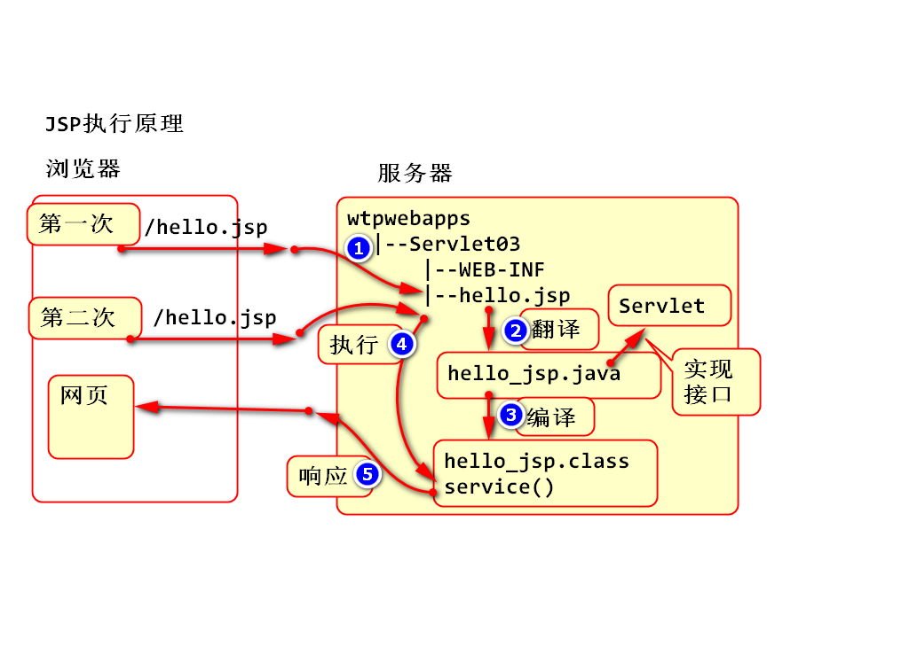
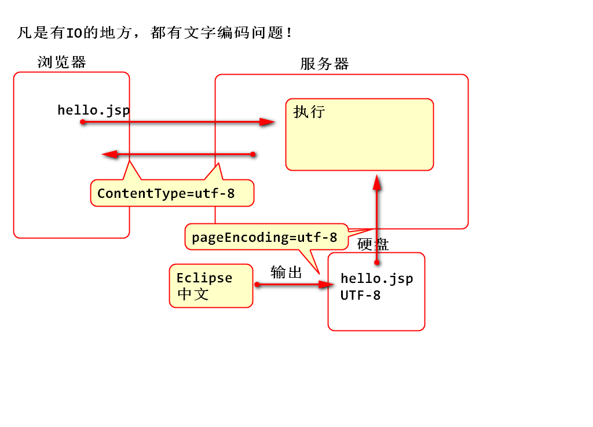
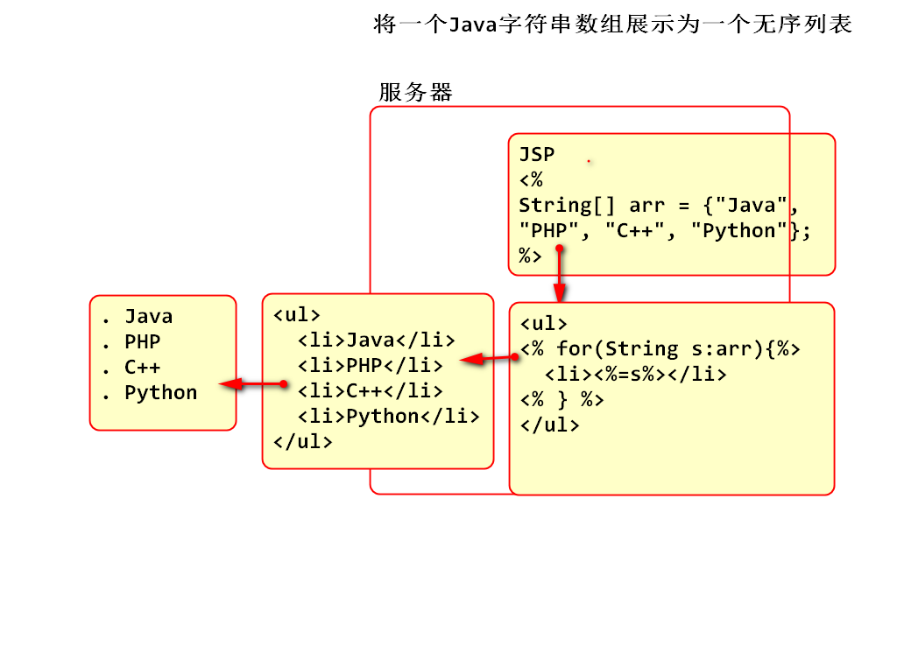
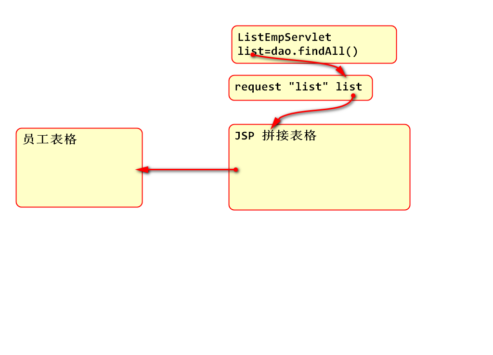
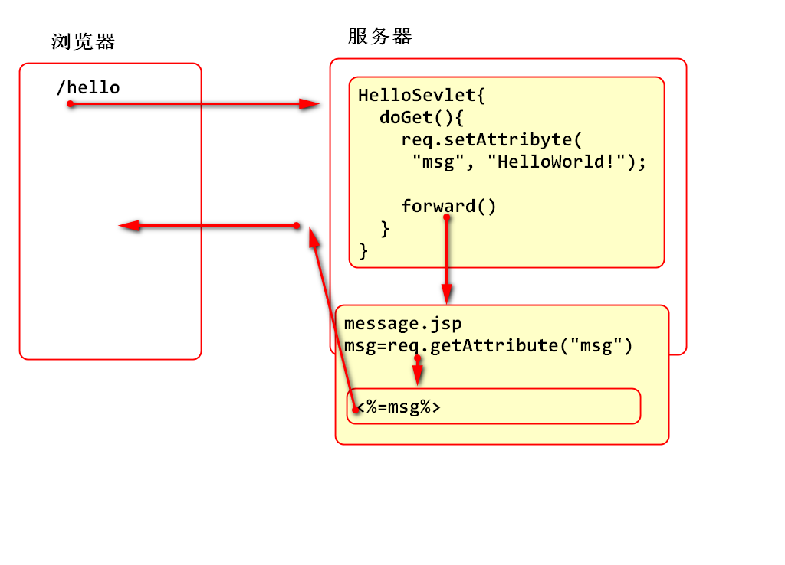

<!-- TOC -->
<!-- TOC -->
- [Servlet](#servlet)
    - [JSP](#jsp)<br>
            - [案例：hello.jsp](#案例hellojsp)
    - [JSP工作原理](#jsp工作原理)
    - [JSP 语法](#jsp-语法)
    - [page 声明](#page-声明)
    - [JSP Java 脚本](#jsp-java-脚本)<br>
            - [案例: Java脚本](#案例-java脚本)<br>
            - [案例: 利用JSP动态拼接无序列表 demo02.jsp](#案例-利用jsp动态拼接无序列表-demo02jsp)
    - [JSP 内置对象](#jsp-内置对象)
    - [request共享数据](#request共享数据)<br>
            - [案例](#案例)
    - [转发Forward](#转发forward)
            - [案例：Servlet与JSP协作显示数据](#案例-Servlet与JSP协作显示数据)
    - [利用Servlet和JSP协作显示员工列表](#利用servlet和jsp协作显示员工列表)
    - [利用AdminLTE模板显示员工列表](#利用adminlte模板显示员工列表)
<!-- /TOC -->
<!-- /TOC -->

# Servlet

## 回顾
1. Servlet接收参数
	1. getParamter 
	2. getParamterValues
2. 请求参数编码问题
	1. post请求，在request上设置编码
	2. get请求，在Tomcat上设置属性
3. Servlet调用JDBC API 连接数据库
	1. 得出结论，应该按照功能模块对软件进行重构。

## JSP 

什么是JSP?
1. JSP(Java Server Page)SUN参考了微软的ASP技术，以Servlet为基础设计动态页面拼接解决方案。
2. JSP 就是 Servlet
3. 使用HTML语法书写的Servlet
	1. 用HTML语法书写
	2. 嵌入 Servlet 语法片段
	3. 可以使用传统的HTML编辑器书写JSP
4. JSP适合书写页面，不适合处理软件业务逻辑
5. Java（SUN）建议Servlet与JSP搭配使用，利用Servlet处理软件的业务逻辑，利用JSP处理页面显示效果。提供Servlet以JSP搭配使用的API：协作转发。

#### 案例：hello.jsp
```
<%@ page language="java" 
contentType="text/html; charset=UTF-8"
pageEncoding="UTF-8"
import="java.util.List"
%>
<!DOCTYPE html>
<html>
<head>
<meta charset="UTF-8">
<title>第一个JSP</title>
</head>
<body>
<h1>第一个JSP</h1>
<p>网页中嵌入Java代码<%="Hello World!"%></p> 
</body>
</html>
```
## JSP工作原理

先翻译为Servlet在编译为class，最终执行的是class程序。



## JSP 语法

## page 声明

1. 使用标记  <%@ page %> 声明
2. 用于声明当前JSP环境参数
3. 重要的属性有
```
language="java" 声明当前页面使用的脚本语言是Java
contentType="text/html; charset=UTF-8" 用于设置 response 的编码
pageEncoding="UTF-8" 是指当前网页的本地保存编码
import="java.util.List,java.sql.Connection" 用于引入页面中使用的API 
```


常用声明如下：
```
<%@ page language="java" 
contentType="text/html; charset=UTF-8"
pageEncoding="UTF-8"%>
```
## JSP Java 脚本

有3种：

1. Java脚本，任何的Java程序, 编译以后是service方法中的代码
```
<% System.out.println("Hello!"); %>
<% out.print("Hello World!");%>
```
2. 表达式, 用于向页面输出信息，编译以后是 out.print(表达式);

`<%="Hello World!" %>` 编译为 out.print("Hello World"); 

3. 声明, 用于在Servlet中声明，对象的属性和方法, 编译后就是Servlet的属性和方法。 很少使用
```
<%! int age = 5; %>
<%! 
	public void test(){
		System.out.println("Hi");
	}
%>
```
> JSTL/EL 标准标签库和表达式语言，后来替换了 JSP脚本


#### 案例: Java脚本
```
<%@ page language="java" 
contentType="text/html; charset=UTF-8"
pageEncoding="UTF-8"%>
<!DOCTYPE html>
<html>
<head>
<meta charset="UTF-8">
<title>JSP Java脚本</title>
</head>
<body>
<h1>JSP中的Java脚本</h1>
<h2>Java脚本</h2>
<%
	System.out.println("试试Java程序！"); 
	for(int i=0; i<5; i++){
		//网页中输出信息 0,1,2,3,4,
		out.print(i + ","); 
	}
%>	
<h2>JSP表达式</h2>
<%="Time:"%> <%=System.currentTimeMillis()%>
<h2>JSP声明</h2>
<%! //当前Servlet属性和方法
	int a = 5;
	public double test(){
		return Math.PI*a*a;
	}
%>
利用表达式调用test方法
<%=test()%>
</body>
</html>
```
#### 案例: 利用JSP动态拼接无序列表 demo02.jsp


```
<%@ page 
language="java" 
contentType="text/html; charset=UTF-8"
pageEncoding="UTF-8"%>
<!DOCTYPE html>
<html>
<head>
<meta charset="UTF-8">
<title>案例</title>
</head>
<body>
<h1>JSP功能演示</h1>
<p>
	将一个Java字符串数组展示为一个无序列表
</p>
<%
	String[] arr={"Java", "PHP", "C++", "Python"};
%>
<ul>
<%for(String s:arr){%>
	<li><%=s %></li>
<%} %>
</ul>
<p>JSP中的代码，目的是为了拼接HTML标签！</p>
</body>
</html>
```


## JSP 内置对象

JSP 预先定义了引用，引用了默认的对象

1. 使用这些对象时候，就不需要创建对象了，可以直接使用。
2. 这些对象都与Web编译有关
3. 9个内置对象
	1. request 浏览器请求
	2. response 向浏览器发送的响应
	3. out对象，代表响应的 Body 
	4. page 就是 this 代表当前Servlet对象
	5. config
	6. application
	7. session
	8. pageContext
	9. exception


## request共享数据

request 提供了缓存机制，可以存储 Attribute（属性）



1. 保存数据方法 request.setAttribute("key", value);
	- 存储多个数据 要使用多个key
	- 如果key相同，则替换数据
	- value可以是任何类型
2. 读取数据的方法 value=request.getAttribute("key")	
	1. 根据key返回对应的value
	2. 如果key没有对应的value，返回null
3. 删除数据方法 request.removeAttribute("key")

#### 案例
```
<%@ page 
language="java" 
contentType="text/html; charset=UTF-8"
pageEncoding="UTF-8"%>
<!DOCTYPE html>
<html>
<head>
<meta charset="UTF-8">
<title>案例</title>
</head>
<body>
<h1>request对象</h1>
<p>
	request对象共享数据
</p>
<%
	//将信息存储到 request 的缓存中
	request.setAttribute("msg", "Hello World!"); 
%>
取出request中的数据
<% 
	String str = (String)request.getAttribute("msg");
	request.removeAttribute("msg");
%>
<%=str%>
</body>
</html>
```
## 转发Forward

什么是转发：SUN建议利用Servlet处理软件的业务功能，处理完成后转到JSP显示业务处理结果。 SUN在Servlet中定义从Servlet到JSP协作API，这个API功能叫：转发。

1. 转发API叫请求协作对象
2. 利用这个API可以从Servlet转到JSP继续执行
3. 转发期间Servlet和JSP共享同一对 request、response
	1. 可以用request在Servlet和JSP之间传递数据。
	2. response也是同一个，要注意response只能响应一次，所以在Servlet不能处理response，否则出现运行错。
4. JSP只是作为Servlet的显示组件时候，建议将JSP保存到WEB-INF文件夹中，避免用户之间访问JSP看到“半吊子”结果。

原理：



#### 案例：Servlet与JSP协作显示数据

1. 编写Servlet
```
/**
 * 演示Servlet到JSP协作转发
 */
public class HelloServlet extends HttpServlet {
	private static final long serialVersionUID = 1L;

	@Override
	protected void doGet(HttpServletRequest req, HttpServletResponse resp) 
	throws ServletException, IOException {
		//将数据存储到request，用于与JSP共享数据
		req.setAttribute("msg", "Hello World!");

		//在JSP和Servlet协作处理时候，响应应该由JSP处理， Servelt中不要处理响应
		//resp.getWriter().write("Hello"); 
		//resp.flushBuffer();

		//RequestDispatcher 请求协作对象
		//创建对象时候需要提供一个目标页面的路径
		RequestDispatcher rd=req.getRequestDispatcher("/WEB-INF/jsp/message.jsp");
		//调用forward方法转发到目标JSP继续执行
		//其中目标JSP与当前Servlet共享了同一对req, resp
		rd.forward(req, resp);
	}
}
```
2. 编写 /WEB-INF/jsp/message.jsp
```
<%@ page 
	language="java" 
	contentType="text/html; charset=UTF-8"
    pageEncoding="UTF-8"%>
<!DOCTYPE html>
<html>
<head>
<meta charset="UTF-8">
<title>Servlet与JSP转发协作</title>
</head>
<body>
	<h1>Servlet与JSP转发协作</h1>
	<p>将JSP作为Servlet的显示组件，显示Servlet中处理的
	结果。</p>
	<%
		String msg=(String)request.getAttribute("msg");
	%>
	显示Servlet传递到JSP的数据：<%=msg%>
</body>
</html>
```
3. 测试

		http://localhost:8080/Servlet03/hello

## 利用Servlet和JSP协作显示员工列表

1. 编写Servlet
```
**
 * 利用Servlet与JSP协作显示员工列表
 */
public class ListEmpServlet extends HttpServlet {
	private static final long serialVersionUID = 1L;

	protected void doGet(HttpServletRequest request, HttpServletResponse response) throws 
	ServletException, IOException {

		EmpDao dao = new EmpDao();
		List<Emp> list = dao.findAll();

		//利用request对象向JSP传送计算结果
		request.setAttribute("list", list); 

		//转发到JSP页面显示结果 list-emp.jsp
		RequestDispatcher rd=request.getRequestDispatcher("/WEB-INF/jsp/list-emp.jsp");
		rd.forward(request, response); 
	}

}
```
2. 编写JSP /WEB-INF/jsp/list-emp.jsp
```
<%@ page 
	language="java" 
	contentType="text/html; charset=UTF-8"
    pageEncoding="UTF-8"
    import="java.util.List,entity.Emp"%>
<!DOCTYPE html>
<html>
<head>
<meta charset="UTF-8">
<title>显示员工列表</title>
</head>
<body>
	<h1>员工列表</h1>
	<%
		//获取Servlet传递的数据
		List<Emp> list=(List<Emp>)
			request.getAttribute("list");
	%>
	<table>
		<tr>
			<td>编号</td>
			<td>姓名</td>
			<td>工作</td>
			<td>老板</td>
			<td>日期</td>
			<td>薪资</td>
		</tr>
		<% for(Emp emp:list){ %>
		<tr>
			<td><%=emp.getEmpno()%></td>
			<td><%=emp.getEname()%></td>
			<td><%=emp.getJob()%></td>
			<td><%=emp.getMgr()%></td>
			<td><%=emp.getHiredate()%></td>
			<td><%=emp.getSal()%></td>
		</tr>
		<%} %>
	</table>
</body>
</html>
```
3. 测试

http://localhost:8080/Servlet03/list

## 利用AdminLTE模板显示员工列表

1. 导入AdminLTE到 webapp文件夹
2. 根据starter.html创建JSP页面 /WEB-INF/jsp/list.jsp

> 如下是list.jsp局部代码：
```
  <!-- Content Wrapper. Contains page content -->
  <div class="content-wrapper">
    <!-- Content Header (Page header) -->
    <section class="content-header">
      <h1>
	员工列表
	<small>Optional description</small>
      </h1>
      <ol class="breadcrumb">
	<li><a href="#"><i class="fa fa-dashboard"></i> Level</a></li>
	<li class="active">Here</li>
      </ol>
    </section>

    <!-- Main content -->
    <section class="content container-fluid">

      <!--------------------------
	| Your Page Content Here |
	-------------------------->
	  <div class="box">
	    <div class="box-header">
	      <h3 class="box-title">Condensed Full Width Table</h3>
	    </div>
	    <!-- /.box-header -->
	    <div class="box-body no-padding">
	      <table class="table table-condensed">
		<tr>
		  <th>#</th>
		  <th>姓名</th>
		  <th>工作</th>
		  <th>老板</th>
		  <th>日期</th>
		  <th>部门</th>
		  <th>工资</th>
		  <th>提成</th>
		</tr>
		<%
    List<Emp> list=(List<Emp>)
	request.getAttribute("list");            
		%>
		<%for(Emp emp:list){ %>
		<tr>
		  <td><%=emp.getEmpno()%></td>
		  <td><%=emp.getEname()%></td>
		  <td><%=emp.getJob()%></td>
		  <td><%=emp.getMgr()%></td>
		  <td><%=emp.getHiredate()%></td>
		  <td><%=emp.getDeptno()%></td>
		  <td><%=emp.getSal()%></td>
		  <td><%=emp.getComm()%></td>
		</tr>
		<%} %>
	      </table>
	    </div>
	    <!-- /.box-body -->
	  </div>
	  <!-- /.box -->

    </section>
    <!-- /.content -->
  </div>
  <!-- /.content-wrapper -->
```
3. 重构 Servlet
```
//转发到JSP页面显示结果 list.jsp
RequestDispatcher rd=request.getRequestDispatcher("/WEB-INF/jsp/list.jsp");
rd.forward(request, response); 
```
4. 测试

		http://localhost:8080/Servlet03/list
