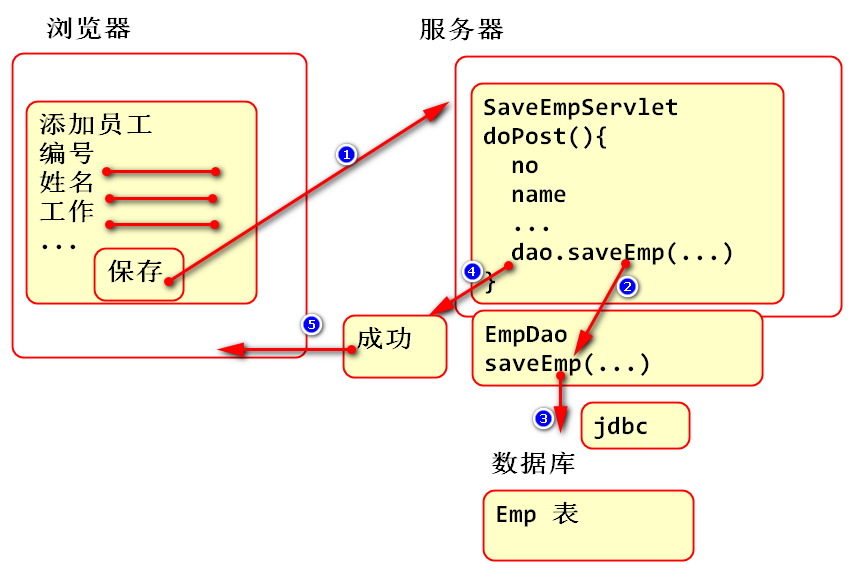
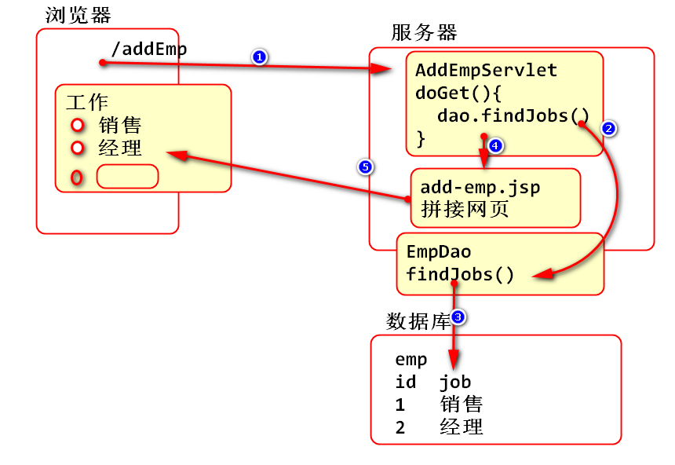
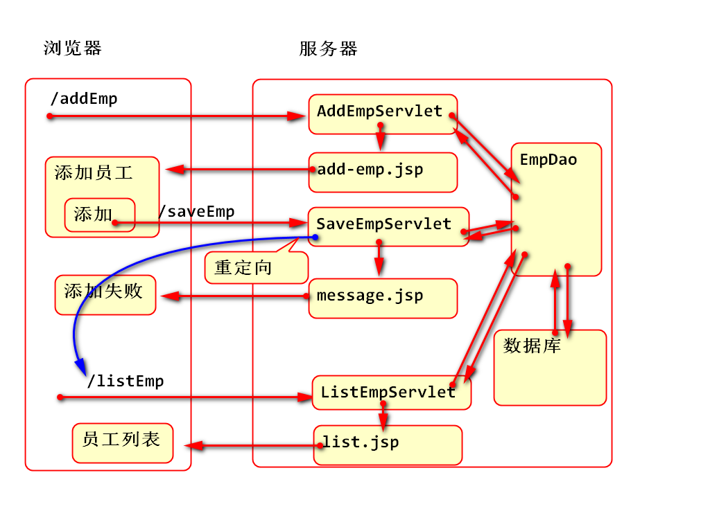

<!-- TOC -->
- [Servlet](#servlet)<br>
            - [案例: 添加员工功能](#案例-添加员工功能)<br>
            - [案例: 更新添加员工页面，实现选项列表功能](#案例-更新添加员工页面实现选项列表功能)<br>
	- [重定向](#重定向)<Br>
            - [案例](#案例)<br>
            - [案例: 利用重定向添加Emp后显示Emp列表](#案例-利用重定向添加emp后显示emp列表)<br>
<!-- /TOC -->

# Servlet

#### 案例: 添加员工功能

思路

1. 数据在哪里，如何处理这些数据
	1. insert into ...
2. 使用JDBC操作数据库
3. EmpDao封装插入操作，saveEmp
4. 利用表单收集数据
5. 利用Servlet接收数据，调用saveEmp完成操作

原理：



案例步骤

1. 在EmpDao中创建数据层访问方法
```
/**
 * 将emp对象中的数据保存到数据库中
 * @param emp 代表新添加的数据
 */
public void saveEmp(Emp emp) {
	String sql = "insert into emp "
			+ "(empno, ename, job, mgr, "
			+ "hiredate, sal, comm, deptno) "
			+ "values (?,?,?,?,?,?,?,?)"; 
	Connection conn = null;
	try {
		conn = DBUtil.getConnection();
		PreparedStatement ps=conn.prepareStatement(sql);
		ps.setInt(1, emp.getEmpno());
		ps.setString(2, emp.getEname());
		ps.setString(3, emp.getJob());
		ps.setInt(4, emp.getMgr());
		ps.setDate(5, emp.getHiredate());
		ps.setDouble(6, emp.getSal());
		ps.setDouble(7, emp.getComm());
		ps.setInt(8, emp.getDeptno());
		int n = ps.executeUpdate();
		if(n!=1) {
			throw new RuntimeException("插入失败！");
		}
	} catch (Exception e) {
		e.printStackTrace();
		throw new RuntimeException(e);
	} finally {
		DBUtil.close(conn);
	}
}
```
2. 测试
```
@Test
public void testSaveEmp() {
	long now = System.currentTimeMillis();
	Emp emp=new Emp(8000, "Tom", "端茶的", 7839, 
			new Date(now), 2000.0, 100.0, 10); 
	EmpDao dao = new EmpDao();
	dao.saveEmp(emp); 
}
```
3. 利用模板starter.html 创建add-emp.html
核心代码:

```
    <div class="row">
      <!-- left column -->
      <div class="col-md-8">
        <!-- general form elements -->
        <div class="box box-primary">
          <div class="box-header with-border">
            <h3 class="box-title">新员工信息</h3>
          </div>
          <!-- /.box-header -->
          <!-- form start -->
          <form role="form" action="saveEmp" method="post">
            <div class="box-body">
              <div class="form-group">
                <label for="empno">员工号</label>
                <input type="text" class="form-control" 
                  id="empno" placeholder="输入新员工号"
                  name="empno">
              </div>
              <div class="form-group">
                <label for="ename">员工名</label>
                <input type="text" class="form-control" 
                id="ename" placeholder="输入员工名"
                name="ename">
              </div>
              <div class="form-group">
                <label for="job">工作</label>
                <input type="text" class="form-control" 
                id="job" placeholder="输入工作"
                name="job">
              </div>
              <div class="form-group">
                <label for="hiredate">入职日期</label>
                <input type="date" class="form-control" 
                id="hiredate" placeholder="输入入职日期"
                name="hiredate">
              </div>
              <div class="form-group">
                <label for="mgr">汇报人ID</label>
                <input type="text" class="form-control" 
                id="mgr" placeholder="输入汇报人ID"
                name="mgr">
              </div>
              <div class="form-group">
                <label for="sal">薪资</label>
                <input type="text" class="form-control" 
                id="sal" placeholder="输入薪资"
                name="sal">
              </div>
              <div class="form-group">
                <label for="comm">提成</label>
                <input type="text" class="form-control" 
                id="comm" placeholder="输入提成"
                name="comm">
              </div>
              <div class="form-group">
                <label for="deptno">部门ID</label>
                <input type="text" class="form-control" 
                id="deptno" placeholder="输入部门ID"
                name="deptno">
              </div>

            </div>
            <!-- /.box-body -->

            <div class="box-footer">
              <button type="submit" class="btn btn-primary">保存</button>
            </div>
          </form>
        </div>
        <!-- /.box -->

      </div>
      <!--/.col (left) -->
    </div>
    <!-- /.row -->
```
4. 编写Servlet类处理post请求
```	
/**
 * 接收添加员工信息的表单的数据，并且保存到数据库中
 */
public class SaveEmpServlet extends HttpServlet {
  private static final long serialVersionUID = 1L;

  protected void doPost(HttpServletRequest request,
      HttpServletResponse response) throws ServletException, IOException {
    try {
      request.setCharacterEncoding("UTF-8");
      String strEmpno = request.getParameter("empno");
      int empno = Integer.parseInt(strEmpno);
      String ename = request.getParameter("ename");
      String job = request.getParameter("job");
      String strMgr = request.getParameter("mgr");
      int mgr = Integer.parseInt(strMgr);
      String strHiredate = 
          request.getParameter("hiredate");
      SimpleDateFormat fmt=new SimpleDateFormat(
          "yyyy-MM-dd");
      Date date = fmt.parse(strHiredate);
      java.sql.Date hiredate=new java.sql.Date(
          date.getTime());
      String strSal = request.getParameter("sal");
      double sal = Double.parseDouble(strSal);
      String strComm = request.getParameter("comm");
      double comm=Double.parseDouble(strComm);
      String strDeptno=request.getParameter("deptno");
      int deptno=Integer.parseInt(strDeptno);

      Emp emp = new Emp(empno, ename, job, mgr,
          hiredate, sal, comm, deptno);
      EmpDao dao = new EmpDao();
      dao.saveEmp(emp);
      //成功
      request.setAttribute("message", "保存成功！");
    }catch(ParseException e) {
      e.printStackTrace();
      //...
    }catch (Exception e) {
      e.printStackTrace();
      //失败
      request.setAttribute("message", "保存失败！");
    }
    request.getRequestDispatcher("/WEB-INF/jsp/msg.jsp")
    .forward(request, response);
  }

}
```
6. 添加 /WEB-INF/jsp/msg.jsp 显示添加消息
```
<% 
	String message=(String)request.getAttribute("message");
	out.print(message);
%>		
```

6. 测试
	1. 先请求 add-emp.html
	2. 填写表单以后提交表单
	
#### 案例: 更新添加员工页面，实现选项列表功能

原理：



案例步骤：

1. 添加数据访问层方法，读取全部工作列表
```
/**
 * 查询员工表中全部的工作
 * @return 工作列表
 */
public List<String> findJobs(){
	String sql = "select distinct job from emp";
	Connection conn = null;
	try {
		conn = DBUtil.getConnection();
		Statement st=conn.createStatement();
		ResultSet rs=st.executeQuery(sql);
		List<String> list = new ArrayList<String>();
		while(rs.next()) {
			list.add(rs.getString("job"));
		}
		return list;
	} catch(Exception e) {
		e.printStackTrace();
		throw new RuntimeException(e);
	} finally {
		DBUtil.close(conn);
	}
}
```

2. 测试
```
@Test
public void testFindJobs() {
	EmpDao dao = new EmpDao();
	List<String> jobs=dao.findJobs();
	System.out.println(jobs); 
}
```
3. 添加Servlet处理get请求
```		
/**
 * 动态展示添加Emp的表单
 */
public class AddEmpServlet extends HttpServlet {
	private static final long serialVersionUID = 1L;

	protected void doGet(HttpServletRequest request,
			HttpServletResponse response) throws ServletException, IOException {
		EmpDao dao = new EmpDao();
		//找到全部的员工信息，作为回报人列表数据
		List<Emp> managers = dao.findAll();
		request.setAttribute("managers", managers);

		//找到全部工作信息作为工作列表
		List<String> jobs=dao.findJobs();
		request.setAttribute("jobs", jobs);
		request.getRequestDispatcher("/WEB-INF/jsp/add-emp.jsp").forward(request, response);
	}
}
```
4. 将add-emp.html移动到 /WEB-INF/jsp/add-emp.jsp, 并且重构

移动时候要注意处理文件编码问题。

```
<div class="row">
<!-- left column -->
<div class="col-md-8">
  <!-- general form elements -->
  <div class="box box-primary">
    <div class="box-header with-border">
      <h3 class="box-title">新员工信息</h3>
    </div>
    <!-- /.box-header -->
    <!-- form start -->
    <form role="form" action="saveEmp" method="post">
      <div class="box-body">
	<div class="form-group">
	  <label for="ename">员工名</label>
	  <input type="text" class="form-control" 
	  id="ename" placeholder="输入员工名"
	  name="ename">
	</div>
<% 
List<String> jobs=(List<String>)request.getAttribute("jobs");
%>
	<div class="form-group">
	  <label>工作</label>
	  <%for(String job:jobs){ %>
	  <div class="radio">
	    <label>
	      <input type="radio" 
		name="job" value="<%=job %>">
	      <%=job %>
	    </label>
	  </div>
	  <%}%>
	  <input type="text" name="addJob"
	    placeholder="添加新工作" >
	</div>
	<div class="form-group">
	  <label for="hiredate">入职日期</label>
	  <input type="date" class="form-control" 
	  id="hiredate" placeholder="输入入职日期"
	  name="hiredate">
	</div>
	<div class="form-group">
	  <label for="mgr">汇报人ID</label>
<% 
List<Emp> managers=(List<Emp>)request.getAttribute("managers");
%>                 
	  <select name="mgr" class="form-control">
		<%for(Emp emp:managers){%>
		<option value="<%=emp.getEmpno()%>">
		  <%=emp.getEname()%>
		</option>
		<%}%>
	  </select>
	</div>
	<div class="form-group">
	  <label for="sal">薪资</label>
	  <input type="text" class="form-control" 
	  id="sal" placeholder="输入薪资"
	  name="sal">
	</div>
	<div class="form-group">
	  <label for="comm">提成</label>
	  <input type="text" class="form-control" 
	  id="comm" placeholder="输入提成"
	  name="comm">
	</div>
	<div class="form-group">
	  <label for="deptno">部门ID</label>
	  <input type="text" class="form-control" 
	  id="deptno" placeholder="输入部门ID"
	  name="deptno">
	</div>

      </div>
      <!-- /.box-body -->

      <div class="box-footer">
	<button type="submit" class="btn btn-primary">保存</button>
      </div>
    </form>
  </div>
  <!-- /.box -->

</div>
<!--/.col (left) -->
</div>
<!-- /.row -->
```
5. 重构 SaveEmpServlet 类，处理保存逻辑(自动生成员工号)
```
/**
 * 接收添加员工信息的表单的数据，并且保存到数据库中
 */
public class SaveEmpServlet extends HttpServlet {
	private static final long serialVersionUID = 1L;

	protected void doPost(HttpServletRequest request,
			HttpServletResponse response) throws ServletException, IOException {
		try {
			request.setCharacterEncoding("UTF-8");
			//String strEmpno = request.getParameter("empno");
			//int empno = Integer.parseInt(strEmpno);

			String ename = request.getParameter("ename");
			String job = request.getParameter("job");
			String strMgr = request.getParameter("mgr");
			int mgr = Integer.parseInt(strMgr);
			String strHiredate = 
					request.getParameter("hiredate");
			SimpleDateFormat fmt=new SimpleDateFormat(
					"yyyy-MM-dd");
			Date date = fmt.parse(strHiredate);
			java.sql.Date hiredate=new java.sql.Date(
					date.getTime());
			String strSal = request.getParameter("sal");
			double sal = Double.parseDouble(strSal);
			String strComm = request.getParameter("comm");
			double comm=Double.parseDouble(strComm);
			String strDeptno=request.getParameter("deptno");
			int deptno=Integer.parseInt(strDeptno);

			//如果添加了新工作，将新的工作添加到员工信息
			String addJob=request.getParameter("addJob");
			if(addJob!=null && !addJob.isEmpty()) {
				job = addJob;
			}

			EmpDao dao = new EmpDao();
			//findMaxEmpno()查找当前最大的员工号
			//自动生成员工号，新员工号为员工号最大值加1
			int empno = dao.findMaxEmpno()+1;

			Emp emp = new Emp(empno, ename, job, mgr, hiredate, sal, comm, deptno);

			dao.saveEmp(emp);
			//成功
			request.setAttribute("message", "保存成功！");

		}catch(ParseException e) {
			e.printStackTrace();
			//...
		}catch (Exception e) {
			e.printStackTrace();
			//失败
			request.setAttribute("message", "保存失败！");
		}
		request.getRequestDispatcher("/WEB-INF/jsp/msg.jsp")
		.forward(request, response);
	}

}
```

6. 添加获取最大员工号方法
```
public Integer findMaxEmpno() {
	String sql = "select max(empno) as empno from emp";
	Connection conn=null;
	try {
		conn = DBUtil.getConnection();
		Statement st = conn.createStatement();
		ResultSet rs=st.executeQuery(sql);
		Integer empno=0;
		while(rs.next()) {
			empno=rs.getInt("empno");
		}
		return empno;
	} catch (Exception e) {
		e.printStackTrace();
		throw new RuntimeException(e);
	}finally {
		DBUtil.close(conn);
	}
}
```
7. 测试：
	1. 先请求 http://localhost:8080/Servlet_v4.2/addEmp
	2. 添加表单后再保存

## 重定向

HTTP协议定义了重定向功能，参考 rfc2616 14.30 Location

重定向功能原理：

1. 在响应消息中发送状态码为 302
2. 在响应头中发送Location，作为定向目标
3. 浏览器在收到 302 消息后，根据Location重写发起**新的请求**

#### 案例
```
public class TestServlet extends HttpServlet {
	private static final long serialVersionUID = 1L;

	protected void doGet(HttpServletRequest request, 
		HttpServletResponse response) throws ServletException, IOException {
		//发送重定向响应
		response.setStatus(302); 
		response.setHeader("Location", "http://google.com");
	}

}
```
> 测试时候请求Servlet会重新转向网站http://google.com

response提供了API，简化如上编程，其结果一样：
```
public class TestServlet extends HttpServlet {
	private static final long serialVersionUID = 1L;

	protected void doGet(HttpServletRequest request, 
		HttpServletResponse response) throws ServletException, IOException {
		//发送重定向响应
		//response.setStatus(302); 
		//response.setHeader("Location", "http://google.com");

		//sendRedirect与上述两行代码完全等价
		response.sendRedirect("http://google.com"); 
	}

}
```
#### 案例: 利用重定向添加Emp后显示Emp列表

原理：



只需要修改 SaveEmpServlet即可：
```
//成功
response.sendRedirect("listEmp"); 
return;
```

测试
