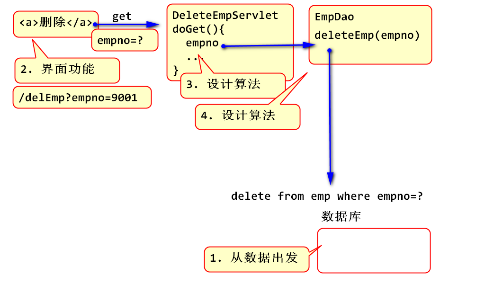
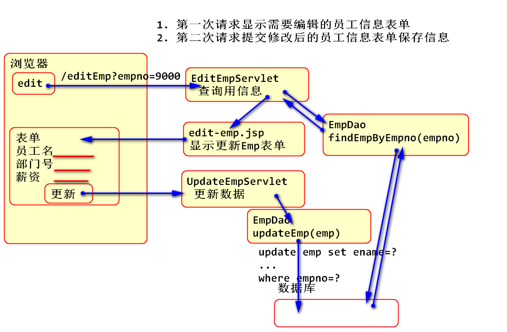

<!-- TOC -->
- [Servlet](#servlet)
    - [转发和重定向的区别](#转发和重定向的区别)
            - [案例: 删除员工功能](#案例-删除员工功能)
    - [案例: 实现修改员工信息的功能](#案例-实现修改员工信息的功能)
    - [案例: 更新菜单](#案例-更新菜单)
<!-- /TOC -->


# Servlet

## 转发和重定向的区别

考察目的：通过容易混淆的概念考察是否有编程经验。

1. 这个两个概念没有关系
2. 转发： 用于实现Servlet和JSP的协作，Servlet处理完业务转发到JSP显示处理结果。
	1. 浏览器对服务器发起的一次请求，请求在Servlet到JSP之间转发
3. 重定向：一个URL请求处理后，返回302状态和目标URL由客户端浏览器重新定向到新的URL。
	1. 服务器和浏览器配合，浏览器先后发起了两次请求，两个请求可以跨越不同的网站。

#### 案例: 删除员工功能

思路：

1. 先考虑员工数据存储在那个位置，如何用SQL删除一个员工数据
2. 再考虑界面功能效果，在界面上如何体现删除功能
3. 再根据学过的知识，如何将处理页面的请求并且执行SQL

原理：



案例步骤：

1. 编写EmpDao中的删除方法
```
/**
 * 根据员工号删除员工信息，如果删除成功返回1
 * @param empno
 * @return 删除记录行数
 */
public int deleteEmp(Integer empno) {
  String sql = "delete from emp where empno=?";
  Connection conn = null;
  try {
    conn = DBUtil.getConnection();
    PreparedStatement ps=conn.prepareStatement(sql);
    ps.setInt(1, empno);
    int n = ps.executeUpdate();
    return n;
  } catch (Exception e) {
    e.printStackTrace();
    throw new RuntimeException(e);
  }finally {
    DBUtil.close(conn); 
  }
}
```
2. 测试
```
@Test
public void testDeleteEmp() {
  int empno = 9001;
  EmpDao dao = new EmpDao();
  int n = dao.deleteEmp(empno);
  System.out.println(n); 
}
```
3. 重构列表界面list.jsp 添加 删除 功能按钮
```
<table class="table table-condensed">
  <tr>
    <th>#</th>
    <th>姓名</th>
    <th>工作</th>
    <th>老板</th>
    <th>日期</th>
    <th>部门</th>
    <th>工资</th>
    <th>提成</th>
    <th></th>
  </tr>
  <%
  List<Emp> list=(List<Emp>)
  request.getAttribute("list");            
  %>
  <%for(Emp emp:list){ %>
  <tr>
    <td><%=emp.getEmpno()%></td>
    <td><%=emp.getEname()%></td>
    <td><%=emp.getJob()%></td>
    <td><%=emp.getMgr()%></td>
    <td><%=emp.getHiredate()%></td>
    <td><%=emp.getDeptno()%></td>
    <td><%=emp.getSal()%></td>
    <td><%=emp.getComm()%></td>
    <td><a onclick="return confirm('真的要删除 <%=emp.getEname()%> 吗？')" href="delEmp?empno=<%=emp.getEmpno()%>" 
        class="btn btn-xs btn-block btn-info"
        ><i class="fa fa-trash-o"></i></a></td>
  </tr>
  <%} %>
</table>
```
4. 添加Servlet处理get请求
```
public class DeleteEmpServlet extends HttpServlet {
  private static final long serialVersionUID = 1L;

  protected void doGet(HttpServletRequest request, HttpServletResponse response) 
  throws ServletException, IOException {
    String str = request.getParameter("empno");
    Integer empno = Integer.parseInt(str);
    EmpDao dao = new EmpDao();
    int n = dao.deleteEmp(empno);
    if(n==1) {
      System.out.println("删除成功！");
      response.sendRedirect("listEmp"); 
      return;
    }else {
      System.out.println("删除失败！");
      request.setAttribute("message", "删除失败！");
      request.getRequestDispatcher(
          "/WEB-INF/jsp/msg.jsp");
    }
  }
}
```
5. 配置
```
<servlet>
  <description></description>
  <display-name>DeleteEmpServlet</display-name>
  <servlet-name>DeleteEmpServlet</servlet-name>
  <servlet-class>web.DeleteEmpServlet</servlet-class>
</servlet>
<servlet-mapping>
  <servlet-name>DeleteEmpServlet</servlet-name>
  <url-pattern>/delEmp</url-pattern>
</servlet-mapping>
```
6. 测试

#### 案例: 实现修改员工信息的功能

实现原理：

1. 先读取员工信息，显示到表单里面
2. 再提交表单中修改以后的数据保存到数据库中



实现步骤:

1. EmpDao添加方法读取员工信息
```
/**
 * 根据员工号查询一行员工数据
 * @param empno 员工号
 * @return 返回Emp对象，封装了员工数据
 *       如果找不到，则返回null
 */
public Emp findEmpByEmpno(Integer empno) {
  String sql = "select * from emp where empno=?";
  Connection conn = null;
  try {
    conn = DBUtil.getConnection();
    PreparedStatement ps=conn.prepareStatement(sql);
    ps.setInt(1, empno);
    ResultSet rs=ps.executeQuery();
    Emp emp = null;
    while(rs.next()) {
      emp = empMapper(rs);
    }
    return emp;
  } catch (Exception e) {
    e.printStackTrace();
    throw new RuntimeException(e);
  }finally {
    DBUtil.close(conn);
  }
}
// 将当前rs中的数据映射到Emp对象中
private Emp empMapper(ResultSet rs) throws SQLException {
  int empno=rs.getInt("empno");
  String ename=rs.getString("ename");
  String job=rs.getString("job");
  int mgr = rs.getInt("mgr");
  Date hiredate=rs.getDate("hiredate");
  double sal = rs.getDouble("sal");
  double comm = rs.getDouble("comm");
  int deptno=rs.getInt("deptno");
  Emp emp=new Emp(empno, ename, job, 
    mgr, hiredate, sal, comm, deptno);
  return emp;
}
```
> 编程时候要进行适当的重构，抽取empMapper方法可以简化程序的编写。

2. 测试
```
@Test
public void testFindEmpByEmpno() {
  EmpDao dao = new EmpDao();
  Emp emp = dao.findEmpByEmpno(9000);
  System.out.println(emp); 
}
```
3. 重构 list.jsp 添加修改功能按钮：
```
<td><a href="editEmp?empno=<%=emp.getEmpno()%>" class="btn btn-xs btn-default btn-info">
    <i class="fa fa-edit"></i></a>
    <a onclick="return confirm('真的要删除 <%=emp.getEname()%> 吗？')" href="delEmp?empno=<%=emp.getEmpno()%>" 
    class="btn btn-xs btn-default btn-danger">
    <i class="fa fa-trash-o"></i></a>
 </td>
```
4. 编写Servlet获取信息，转发到JSP
```
/**
 * 显示编辑Emp信息的页面
 */
public class EditEmpServlet extends HttpServlet {
  private static final long serialVersionUID = 1L;

  protected void doGet(HttpServletRequest request,HttpServletResponse response) 
  throws ServletException, IOException {
    //获取员工编号
    String str = request.getParameter("empno");
    Integer empno = Integer.parseInt(str);
    //根据员工编号，查询员工信息
    EmpDao dao = new EmpDao();
    Emp emp = dao.findEmpByEmpno(empno);
    List<String> jobs = dao.findJobs();
    List<Emp> managers = dao.findAll();

    //利用request对象将emp传送到JSP页面中
    request.setAttribute("emp", emp); 
    request.setAttribute("jobs", jobs); 
    request.setAttribute("managers", managers); 

    //转发到JSP显示当前被编辑员工信息
    request.getRequestDispatcher("/WEB-INF/jsp/edit-emp.jsp").forward(request, response); 
  }
}
```
5. 编写edit-emp.jsp 显示员工信息

> 由于edit-emp.jsp 与 add-emp.jsp 布局基本一样，可以复制add-emp.jsp再适当的修改。

```
<div class="row">
  <!-- left column -->
  <div class="col-md-8">
    <!-- general form elements -->
    <div class="box box-primary">
      <div class="box-header with-border">
        <h3 class="box-title">员工信息</h3>
      </div>
      <!-- /.box-header -->
      <% 
      Emp emp=(Emp)request.getAttribute("emp");
      %>
      <!-- form start -->
      <form role="form" action="updateEmp" method="post">
        <div class="box-body">
          <div class="form-group">
            <input type="text" class="form-control" 
            placeholder="员工号" readonly="readonly"
            name="empno" value="<%=emp.getEmpno()%>">
          </div>
          <div class="form-group">
            <label for="ename">员工名</label>
            <input type="text" class="form-control" 
            id="ename" placeholder="输入员工名"
            name="ename" value="<%=emp.getEname()%>">
          </div>
  <% 
  List<String> jobs=(List<String>)request.getAttribute("jobs");
  %>
          <div class="form-group">
            <label>工作</label>
            <%for(String job:jobs){ 
                if(job==null){
                  continue;
                }
            %>
            <div class="radio">
              <label>
                <% 
                if(job.equals(emp.getJob())){
                %>
                <input type="radio" checked="checked" 
                  name="job" value="<%=job %>">
                <%}else{%>
                <input type="radio" 
                  name="job" value="<%=job %>">
                <%}%>
                <%=job %>
              </label>
            </div>
            <%}%>
            <input type="text" name="addJob"
              placeholder="添加新工作" >
          </div>
          <div class="form-group">
            <label for="hiredate">入职日期</label>
            <input type="date" class="form-control" 
            id="hiredate" placeholder="输入入职日期"
            name="hiredate" value="<%=emp.getHiredate()%>"> 
          </div>
          <div class="form-group">
            <label for="mgr">汇报人ID</label>
  <% 
  List<Emp> managers=(List<Emp>)request.getAttribute("managers");
  %>                 
            <select name="mgr" class="form-control">
              <%for(Emp e:managers){%>
              <%if(e.getEmpno().equals(emp.getMgr())){ %>
              <option value="<%=e.getEmpno()%>" 
                selected="selected">
                <%=e.getEname()%>
              </option>
              <%}else{%>
              <option value="<%=e.getEmpno()%>" >
                <%=e.getEname()%>
              </option>
              <%}%>
              <%}%>
            </select>
          </div>
          <div class="form-group">
            <label for="sal">薪资</label>
            <input type="text" class="form-control" 
            id="sal" placeholder="输入薪资"
            name="sal" value="<%=emp.getSal()%>"> 
          </div>
          <div class="form-group">
            <label for="comm">提成</label>
            <input type="text" class="form-control" 
            id="comm" placeholder="输入提成"
            name="comm" value="<%=emp.getComm()%>">
          </div>
          <div class="form-group">
            <label for="deptno">部门ID</label>
            <input type="text" class="form-control" 
            id="deptno" placeholder="输入部门ID"
            name="deptno" value="<%=emp.getDeptno()%>">
          </div>

        </div>
        <!-- /.box-body -->

        <div class="box-footer">
          <button type="submit" class="btn btn-primary">保存</button>
        </div>
      </form>
    </div>
    <!-- /.box -->

  </div>
  <!--/.col (left) -->
</div>
<!-- /.row -->
```
6. 测试编辑界面
7. 添加更新员工数据方法
```
/**
 * 执行更新语句 将emp对象中的数据更新的到数据库
 * 更新时候，按照empno的原则进行更新
 */
public int updateEmp(Emp emp) {
  String sql="update emp set ename=?, job=?, mgr=? , hiredate=?, sal=?, comm=?, deptno=?, where empno=?";
  Connection conn=null;
  try {
    conn = DBUtil.getConnection();
    PreparedStatement ps=conn.prepareStatement(sql);

    setParams(emp, ps);

    int n = ps.executeUpdate();
    return n;
  } catch (Exception e) {
    e.printStackTrace();
    throw new RuntimeException(e);
  } finally {
    DBUtil.close(conn);
  }
}

private void setParams(Emp emp, PreparedStatement ps) throws SQLException {
  ps.setString(1, emp.getEname());
  ps.setString(2, emp.getJob());
  ps.setInt(3, emp.getMgr());
  ps.setDate(4, emp.getHiredate());
  ps.setDouble(5, emp.getSal());
  ps.setDouble(6, emp.getComm());
  ps.setInt(7, emp.getDeptno());
  ps.setInt(8, emp.getEmpno());
}
```
8. 测试
```
@Test
public void testUpdateEmp() {
  EmpDao dao = new EmpDao();
  Emp emp = dao.findEmpByEmpno(9000);
  emp.setEname("熊大"); 
  dao.updateEmp(emp);
}
```
9. 添加Servlet处理更新表单post请求

```
/**
 * 接收更新员工信息表单数据，并且存储到数据库
 */
public class UpdateEmpServlet extends HttpServlet {
  private static final long serialVersionUID = 1L;

  protected void doPost(HttpServletRequest request, 
      HttpServletResponse response) throws ServletException, IOException {
    request.setCharacterEncoding("UTF-8");
    try {
      String ename = request.getParameter("ename");
      String job = request.getParameter("job");
      String strMgr = request.getParameter("mgr");
      int mgr = Integer.parseInt(strMgr);
      String strHiredate = request.getParameter("hiredate");
      SimpleDateFormat fmt=new SimpleDateFormat("yyyy-MM-dd");
      Date date = fmt.parse(strHiredate);
      java.sql.Date hiredate=new java.sql.Date(date.getTime());
      String strSal = request.getParameter("sal");
      double sal = Double.parseDouble(strSal);
      String strComm = request.getParameter("comm");
      double comm=Double.parseDouble(strComm);
      String strDeptno=request.getParameter("deptno");
      int deptno=Integer.parseInt(strDeptno);

      //如果添加了新工作，将新的工作添加到员工信息
      String addJob=request.getParameter("addJob");
      if(addJob!=null && !addJob.isEmpty()) {
        job = addJob;
      }

      String sempno = request.getParameter("empno");
      Integer empno = Integer.parseInt(sempno);

      Emp emp = new Emp(empno, ename, job, mgr, hiredate, sal, comm, deptno);

      EmpDao dao = new EmpDao();
      int n = dao.updateEmp(emp);
      if(n==1) {
        response.sendRedirect("listEmp");
        return;
      } else {
        request.setAttribute("msg", "更新失败"); 
      }
    }catch(Exception e) {
      e.printStackTrace();
      request.setAttribute("msg", "更新失败"+e.getMessage()); 
    }
    request.getRequestDispatcher("/WEB-INF/jsp/msg.jsp").forward(request, response); 
  }
}
```
10. 配置
```
<servlet>
  <description></description>
  <display-name>UpdateEmpServlet</display-name>
  <servlet-name>UpdateEmpServlet</servlet-name>
  <servlet-class>web.UpdateEmpServlet</servlet-class>
</servlet>
<servlet-mapping>
  <servlet-name>UpdateEmpServlet</servlet-name>
  <url-pattern>/updateEmp</url-pattern>
</servlet-mapping>
```
11. 测试

#### 案例: 更新菜单

1. list.jsp
```
<!-- Sidebar Menu -->
<ul class="sidebar-menu" data-widget="tree">
  <li class="header">HEADER</li>
  <!-- Optionally, you can add icons to the links -->
  <li class="active"><a href="#"><i class="fa fa-group"></i> <span>全部员工</span></a></li>
  <li><a href="addEmp"><i class="fa fa-user"></i> <span>添加员工</span></a></li>
</ul>
<!-- /.sidebar-menu -->
```
2. add-emp.jsp
```
<!-- Sidebar Menu -->
<ul class="sidebar-menu" data-widget="tree">
  <li class="header">HEADER</li>
  <!-- Optionally, you can add icons to the links -->
  <li><a href="listEmp"><i class="fa fa-group"></i> <span>全部员工</span></a></li>
  <li class="active"><a href="#"><i class="fa fa-user"></i> <span>添加员工</span></a></li>
</ul>
<!-- /.sidebar-menu -->
```
3. edit-emp.jsp
```
<!-- Sidebar Menu -->
<ul class="sidebar-menu" data-widget="tree">
  <li class="header">HEADER</li>
  <!-- Optionally, you can add icons to the links -->
  <li><a href="listEmp"><i class="fa fa-group"></i> <span>全员员工</span></a></li>
  <li><a href="addEmp"><i class="fa fa-user"></i> <span>添加员工</span></a></li>
</ul>
<!-- /.sidebar-menu -->
```
