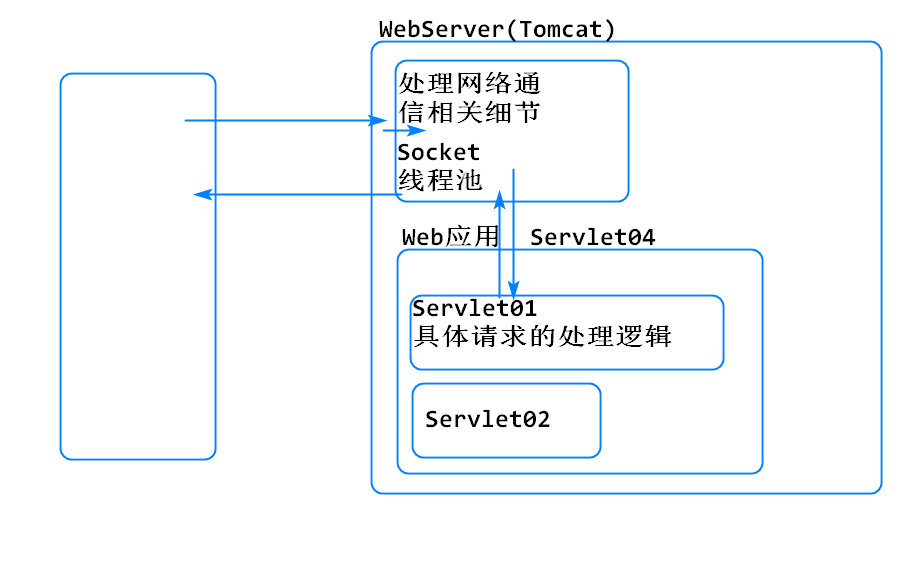
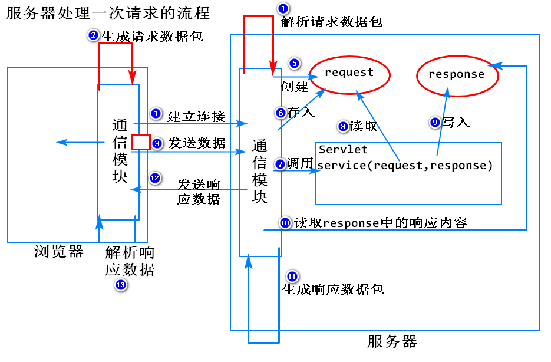
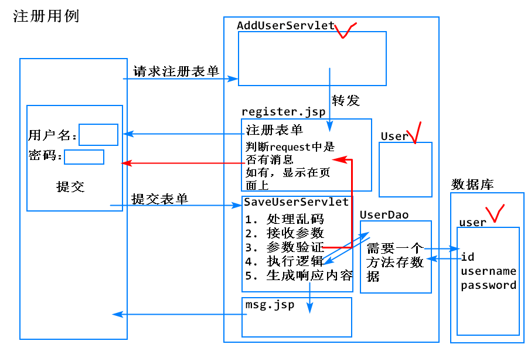
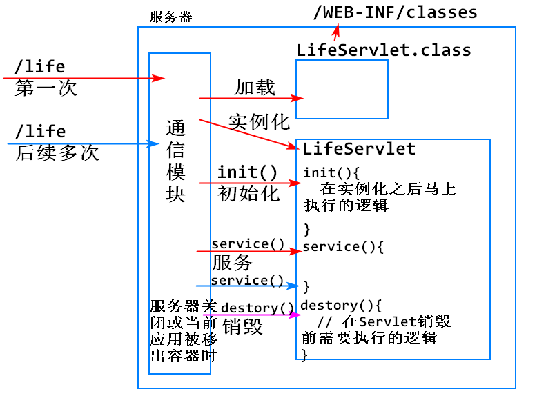

<!-- TOC -->
- [知识点](#知识点)
- [案例: 实现注册,登录表单](#案例-实现注册登录表单)
- [Servlet的生命周期](#servlet的生命周期)
<!-- /TOC -->

## 知识点
1. Web服务器(Tomcat)和Servlet是什么关系？
	1. Servlet：是运行在Web服务器上的代码片段，用来处理用户的http请求，是Sun公司定义的JavaEE的组件规范



2. Servlet和html的区别
	1. Servlet生成的响应内容是由代码来实现的，是动态的，可以发生变化的
	2. html生成的响应内容，是不会变化的

3. 请求转发和请求重定向的区别？
	1. 转发：
		1. 一次请求一次响应
		2. 地址栏不变
		3. 需要使用request携带数据
	2. 重定向：
		1. 两次请求两次响应
		2. 地址栏发生变化
		3. 表单提交后跳转列表页面，只能用重定向，使用转发可能造成表单重复提交问题


4. DAO（Data Access Object）
	1. 数据访问对象：封装数据库访问逻辑（封装JDBC代码）
	2. 耦合：负责不同功能的代码混在一起了
	3. 解耦：把混在一起的代码拆开
	4. 实现了Servlet和JDBC逻辑的解耦

5. DAO中的方法名规范-Create Read Update Delete
	1. 增： saveXXX    insertXXX
	2. 删： deleteXXX  removeXXX
	3. 改： updateXXX
	4. 查： 
		1. 查1个   getXXX
		2. 查多个  listXXX
	5. 涉及条件的  byID

6. adminLTE
	1. 新加的内容
  
  
## 案例: 实现注册,登录表单

思路: 


案例步骤:

1. 创建user表
```
create table user(
id int primary key auto_increment,
username varchar(50) unique,
password varchar(50)
);
```

2. 创建User类

> 有利于属性的增加和在其他类中的调用

```
public class User {

  private int id;
  private String username;
  private String password;

  public User() {
    super();
  }
  public User(int id, String username, String password) {
    super();
    this.id = id;
    this.username = username;
    this.password = password;
  }
  public int getId() {
    return id;
  }
  public void setId(int id) {
    this.id = id;
  }
  public String getUsername() {
    return username;
  }
  public void setUsername(String username) {
    this.username = username;
  }
  public String getPassword() {
    return password;
  }
  public void setPassword(String password) {
    this.password = password;
  }
  @Override
  public String toString() {
    return "User [id=" + id + ", username=" + username + ", password=" + password + "]";
  }

}
```


3. 创建UserDao

> 执行具体操作

```
public class UserDao {

	/**
	 * 根据用户名和密码查数据的方法(用于登录)
	 * @param username
	 * @param password
	 * @return true-有数据
	 */
	public boolean getUserByUAP (String username, String password) {
		String sql = "select * from user where username = ? and password = ?";
		try (Connection conn = DBUtil.getConnection(); 
    PreparedStatement ps = conn.prepareStatement(sql)){
			ps.setString(1, username);
			ps.setString(2, password);
			ResultSet rs = ps.executeQuery();
			
			if (rs.next()) {
				return true;
			}
		} catch (Exception e) {
			// TODO: handle exception
			e.printStackTrace();
		}
		return false;
	}
  
  /**
	 * 查询用户名是否存在的方法
	 * @param username
	 * @return true-用户名存在
	 */
	public boolean getUserByUsername(String username) {
		String sql = "select * from user where username = ?";
		try (Connection conn = DBUtil.getConnection(); 
    PreparedStatement ps = conn.prepareStatement(sql)){
			ps.setString(1, username);
			ResultSet rs = ps.executeQuery();
			
			if (rs.next()) {
				return true;
			}
		} catch (Exception e) {
			// TODO: handle exception
			e.printStackTrace();
		}
		return false;
	}
	
  // 保存用户
  public boolean saveUser(User user) {
    String sql="insert into user values(null,?,?)";
    try(Connection conn=DBUtil.getConnection();
        PreparedStatement ps=conn.prepareStatement(sql)
        ){
      // 绑定参数
      ps.setString(1, user.getUsername());
      ps.setString(2, user.getPassword());
      // 执行插入操作
      int n=ps.executeUpdate();
      if(n==1) {
        return true;
      }
    }catch(Exception e) {
      e.printStackTrace();
    }

    return false;
  }
}
```
4. 测试

> 返回flag=true, 保存成功; 再次保存

```
@Test
public void testSaveUser() {
  User user=new User(-1, "admin", "123");
  boolean flag=dao.saveUser(user);
  System.out.println("flag="+flag);
}
```

5. 添加Servlet处理请求
```
public class SaveUserServlet extends HttpServlet {
  private static final long serialVersionUID = 1L;

  protected void doPost(HttpServletRequest request, HttpServletResponse response) 
  throws ServletException, IOException {
    // 1. 处理乱码-请求-post
    request.setCharacterEncoding("utf-8");

    // 2. 接收请求参数
    String username=request.getParameter("username");
    String password=request.getParameter("password");

    // 3. 参数验证
    // 用户名非空验证
    if(username==null || "".equals(username)) {
      // 用户名为空
      request.setAttribute("msg", "用户名不能为空");
      request.getRequestDispatcher("/WEB-INF/jsp/register.jsp").forward(request, response);
      return;
    }

    UserDao dao=new UserDao();
    // 用户名不重复验证
    boolean hasUsername=dao.getUserByUsername(username);
    if(hasUsername) {
      request.setAttribute("msg", "用户名已存在");
      request.getRequestDispatcher("/WEB-INF/jsp/register.jsp").forward(request, response);
      return;
    }

    // 4. 执行逻辑
    User user=new User(-1, username, password);
    boolean flag=dao.saveUser(user);

    // 5. 返回响应内容
    String message=flag?"注册成功":"注册失败";

    request.setAttribute("message", message);

    request.getRequestDispatcher("/WEB-INF/jsp/msg.jsp").forward(request, response);

  }
}
```

6. 重构 register.jsp 添加注册功能

```
<form role="form" action="saveUser" method="post" >
  <div class="box-body">
    <% 
      String msg=(String)request.getAttribute("msg");
    %>

    <div class='<%=msg==null?"form-group":"form-group  has-error" %>' >
      <label for="exampleInputEmail1">Username</label>
      <input type="text" class="form-control" id="exampleInputEmail1" placeholder="enter the username"
       name="username" value='<%=request.getParameter("username")==null?"":request.getParameter("username") %>'
      >
      <!-- 实现用户名的表单回填,密码等敏感信息不做回填 -->
      <span class="help-block"><%=msg==null?"":msg %></span>
    </div>

    <div class="form-group">
      <label for="exampleInputPassword1">Password</label>
      <input type="password" class="form-control" id="exampleInputPassword1" placeholder="Password"
       name="password"
      >
    </div>
  </div>
  <!-- /.box-body -->

  <div class="box-footer">
    <button type="submit" class="btn btn-primary">Register</button>
  </div>
</form>
```

7. 创建AddUserServlet让用户能访问到WEB-INF下的register.jsp
```
public class AddUserServlet extends HttpServlet {
	private static final long serialVersionUID = 1L;

	protected void doGet(HttpServletRequest request, HttpServletResponse response) 
  throws ServletException, IOException {
		request.getRequestDispatcher("/WEB-INF/jsp/register.jsp")
		.forward(request, response);
	}
}
```


## Servlet的生命周期
1. 生命周期包含的阶段
	1. 创建
	2. 初始化
	3. 服务
	4. 销毁


2. 创建的时机<br>
	1. 默认情况：当用户第一次访问一个Servlet映射的路径时，服务器会加载对应的Servlet并实例化；后续用户多次访问同一个路径时，服务器都会使用同一个Servlet实例来响应用户的请求。这样的设计可以提高服务器的效率，节省内存
	2. 配置
		1. <load-on-startup>1</load-on-startup>
		2. 如果该配置的值大于等于0，服务器启动后马上加载和实例化该Servlet

3. 初始化
	1. 当一个Servlet被实例化之后，服务器会马上调用它的init()方法，执行初始化的逻辑
	2. init()方法默认没有任何代码，开发者如果希望Servlet被实例化之后，马上执行什么逻辑，就可以写入到init方法中

4. 服务
	1. 每当有用户请求一个Servlet，服务器都会调用该Servlet的service()方法来处理用户的本次请求
	2. servcie()在Servlet的生命周期中会被调用多次

5. 销毁
	1. 当服务器关闭或者当前web应用被移出容器时，服务器会调用一个Servlet的destory()方法，执行Servlet销毁前的逻辑
	2. 该方法默认是空白的，开发者需要一个Servlet在销毁前执行哪些操作，就可以重写该方法，填入对应的逻辑

6. 注
	1. 4个阶段说清楚：创建、初始化、服务、销毁
	2. 创建：Servlet什么时候被加载和实例化？分2种情况
	3. 初始化和销毁，都只执行1次，服务会执行多次
