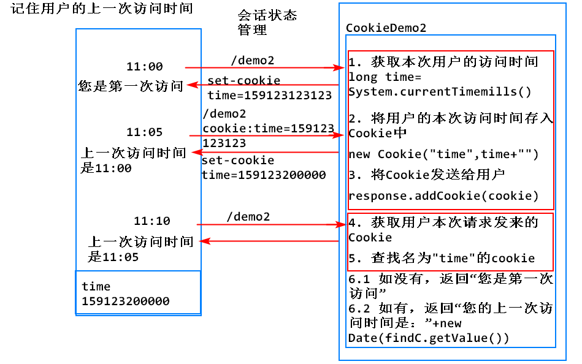

## 会话状态管理

1) 会话：
可以理解为客户端和服务器的一次对话
用户为实现一个目标，从打开客户端开始，到关闭客户端为止，与服务器进行的多次请求和响应，统称为一次会话。
一次会话中可以包含多次的请求和响应。

2) 会话状态：
一次会话过程中产生的临时数据


3) 会话状态管理：
对会话状态进行保存、删除、更新等操作的技术

4) 为什么要有会话状态管理？

      **Http协议**

        1) Http协议的特点？
          1. http协议是无连接的：一次请求一次响应后，主动断开服务器与浏览器的连接
          2. http协议是无状态的：不会保存用户的会话状态

        2）需要提供额外的技术，在http协议下实现会话状态管理

5) 常用的会话状态管理技术：Cookie，Session


## Cookie
将用户的会话状态保存在客户端的技术(咖啡店储值卡)

### Cookie的原理
	1. 服务器通过set-cookie的响应头，将用户的会话状态发送给浏览器进行保存
	2. 浏览器通过cookie的请求头，将自己保存的会话状态发送给服务器来使用

### Cookie的API

		1. Cookie c=new Cookie(name,value);// name是cookie的名称,value是Cookie的值，一个Cookie对象封装了一个键值对
		2. c.getName()
		3. c.getValue()
		4. response.addCookie(cookie);//将cookie存入response中
		5. Cookie[] cs=request.getCookies();

#### 案例：记住姓名

```
public class CookieDemo1 extends HttpServlet {
    private static final long serialVersionUID = 1L;

    protected void doGet(HttpServletRequest request, HttpServletResponse response) throws ServletException, IOException {

        // 获取用户请求发来的用户名
        String username=request.getParameter("name");
        // 将用户名通过Cookie发送给用户
        // response.addHeader("set-cookie", "name="+username);
        Cookie cookie=new Cookie("name", URLEncoder.encode(username, "utf-8"));
        response.addCookie(cookie);

        // 获取本次请求发来的Cookie
        Cookie[] cs=request.getCookies();
        // 获取名称为name的Cookie
        // cs[] cookie1: age=18   cookie2 name=admin
        Cookie findC=null;
        if(cs!=null) {
        for(Cookie c:cs) {
            if(c.getName().equals("name")) {
              findC=c;
            }
        }
    }
    response.setContentType("text/html;charset=utf-8");

    if(findC==null) {
        // 如果没有name的Cookie，提示用户您是第一次访问
        response.getWriter().write("first visit");
    }else {
        response.getWriter().write("welcome "+URLDecoder.decode(findC.getValue(), "utf-8"));
    }
  }
}
```
#### 案例: 记住访问时间
1) 获取本次用户的访问时间long time = System.currentTimemills()
2) 将用户的本次访问时间存入Cookie中 new Cookie("time",time+"")
3) 将Cookie发送给用户 response.addCookie(cookie)
4) 获取用户本次请求发来的Cookie
5) 查找名为time的Cookie
6) 如果没有,返回"您是第一次访问"
   如果有,返回"您的上一次访问时间是:"+new Date(findC.getValue())
```
public class CookieDemo1 extends HttpServlet {
    private static final long serialVersionUID = 1L;


    protected void doGet(HttpServletRequest request, HttpServletResponse response) throws ServletException, IOException {
        // 实现记住用户名功能

        // 获取用户请求发来的用户名
        String username=request.getParameter("name");
        // 将用户名通过Cookie发送给用户
        // response.addHeader("set-cookie", "name="+username);
        Cookie cookie=new Cookie("name", URLEncoder.encode(username, "utf-8"));
        response.addCookie(cookie);

        // 获取本次请求发来的Cookie
        Cookie[] cs=request.getCookies();
        // 获取名称为name的Cookie
        // cs[] cookie1: age=18   cookie2 name=admin
        Cookie findC=null;
        if(cs!=null) {
            for(Cookie c:cs) {
                if(c.getName().equals("name")) {
                    findC=c;
                }
            }
        }
        response.setContentType("text/html;charset=utf-8");

        if(findC==null) {
            // 如果没有name的Cookie，提示用户您是第一次访问
            response.getWriter().write("first visit");
        }else {
            response.getWriter().write("welcome "+URLDecoder.decode(findC.getValue(), "utf-8"));
        }
    }
}
```

### Cookie的存活时间

1) 默认情况下，Cookie是会话级别的，会被保存在浏览器的内存中，一旦浏览器关闭，则保存的Cookie会被销毁
2) 可以手动为一个Cookie设定存活时间，该Cookie会被保存在浏览器的临时文件夹中（硬盘上），在到期时间之前，即使多次关闭浏览器，该Cookie依旧存在
		cookie.setMaxAge(60*60*24);//int second

### Cookie的路径问题

浏览器如何决定在一次请求中携带哪些Cookie？

	Cookie有2个属性，一个是域名(domain)，一个是路径(path)
	如果本次请求的url与一个Cookie的domain+path一致，或者是该Cookie的domain+path的子路径，则本次请求携带该Cookie
	如果不设置一个Cookie的路径，该Cookie的路径默认与发送该Cookie的Servlet的父路径一致
	可以手动设定一个Cookie的domain和path属性

		cookie.setDomain();
        //不建议使用,浏览器厂商默认拒绝第三方Cookie，如果发现一个Cookie设置了domain,很可能直接拒收该Cookie

		cookie.setPath();

		request.getContextPath();//动态返回当前项目映射的路径 /Servlet07
	


### 浏览器如何识别一个Cookie

1. 浏览器使用一个Cookie的name+path+domain的组合来标识一个Cookie
2. 可能出现2个name完全一致的Cookie


### 如何删除一个Cookie

创建一个和要删除的Cookie同name,同path，同domain的Cookie，并设置maxAge=0

```
public class DelCookie extends HttpServlet {
	private static final long serialVersionUID = 1L;

	protected void doGet(HttpServletRequest request, HttpServletResponse response) throws ServletException, IOException {
		// 删除名为time的Cookie
		Cookie cookie=new Cookie("time","");
		// 设置Cookie的路径
		cookie.setPath(request.getContextPath());
		// 设置Cookie的存活时间为0
		cookie.setMaxAge(0);
		
		response.addCookie(cookie);
	}

}
```

### Cookie中的中文问题

1) 默认情况下，Cookie中不能出现中，如有中文，会抛出异常：Control character in cookie value or attribute.
2) 原因：根据设计，Cookie中的value使用ASCII字符集进行传输
3) 如何解决？

		String name="张飞";
		String value=URLEncoder.encode(name,"utf-8");
		%E5%BC%A0%E9%A3%9E

		该API可以使用指定的编码规则将中文字符变成对应的16进制表示
		Cookie cookie=new Cookie("name",value);

		String value2=URLDecoder.decode(value,"utf-8");


### 关于Cookie的细节

1. Cookie是以浏览器为单位来进行保存的，不同浏览器之间的Cookie不共享
2. 一个浏览器一般情况下可以保存约300个Cookie
3. 为每个网站大约保存20个Cookie
4. 一个Cookie的大小是有上限的，大约是4kb

#### 练习：实现记住用户名用例


		1. 类似<input type="text / password"><textarea>，如果用户不输入任何内容，就提交表单，服务器收到的值是 ""，不是null
			request.getParameter();
		2. 类似<input type="checkbox"><select><opiton>，让用户去选择的，如果用户什么都不选，就提交表单，服务器收到的值是null

1. 在LoginServlet中实现记住用户名功能
```
// 接受请求参数
String remname = request.getParameter("remname");

// 判断用户是否勾选了记住用户名
if ("true".equals(remname)){
    // 创建Cookie保存用户的用户名
    Cookie cookie = new Cookie(remname, URLEncoder.encode(username,"utf-8"));
    // 设定存活时间
    cookie.setMaxAge(60*60*24*7);// seven days
    // 设定路径
    cookie.setPath(request.getContextPath());
    response.addCookie(cookie);
} else {
    // 删除之前发送的remname的cookie
    Cookie cookie = new Cookie("rename","");
    cookie.setMaxAge(0);
    cookie.setPath(request.getContextPath());
    response.addCookie(cookie);
}
```
2. 在login.jsp中获取remname的Cookie的值
```
<%
    // 查询是否有名字为remname的Cookie
    Cookie[] cs = request.getCookies();
    Cookie findC = null;
    if (cs != null) {
        for (Cookie c : cs) {
            if ("remname".equals(c.getName())) {
                findC = c;
            }
        }
    }
    String username ="";
    if (findC != null) {
        username=URLDecoder.decode(findC.getValue(),"utf-8");
    }
%>
```
3. 将username加入jsp中

```
value='<%=username%>
```
