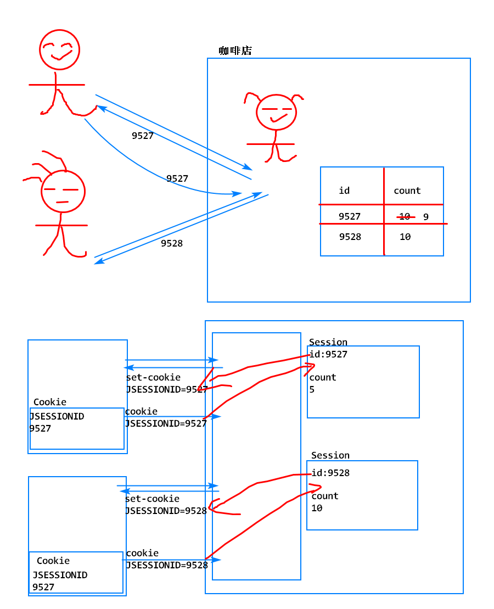
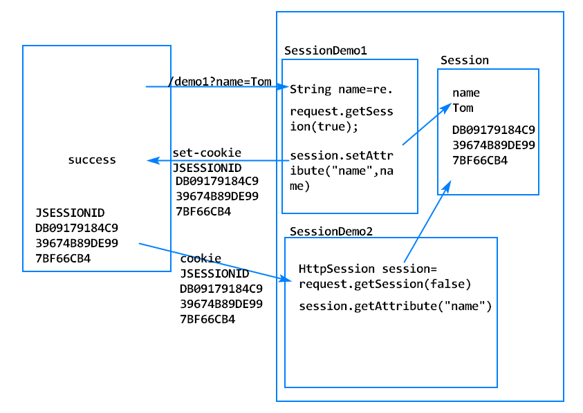
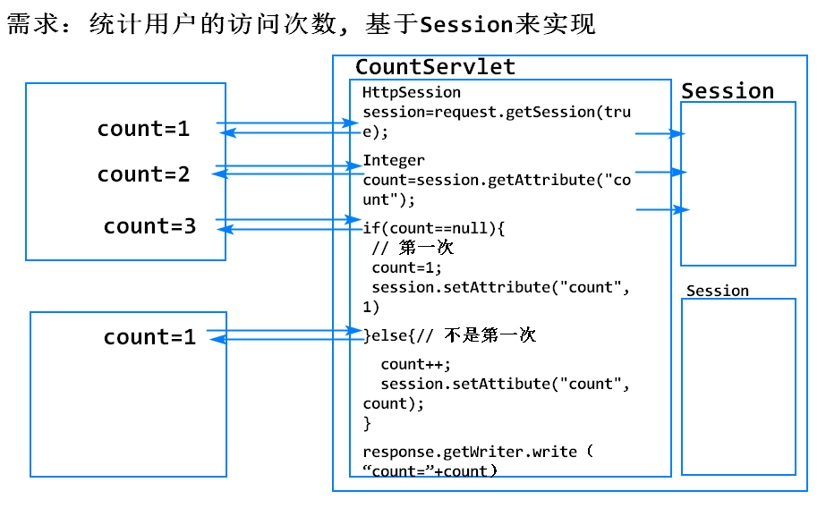
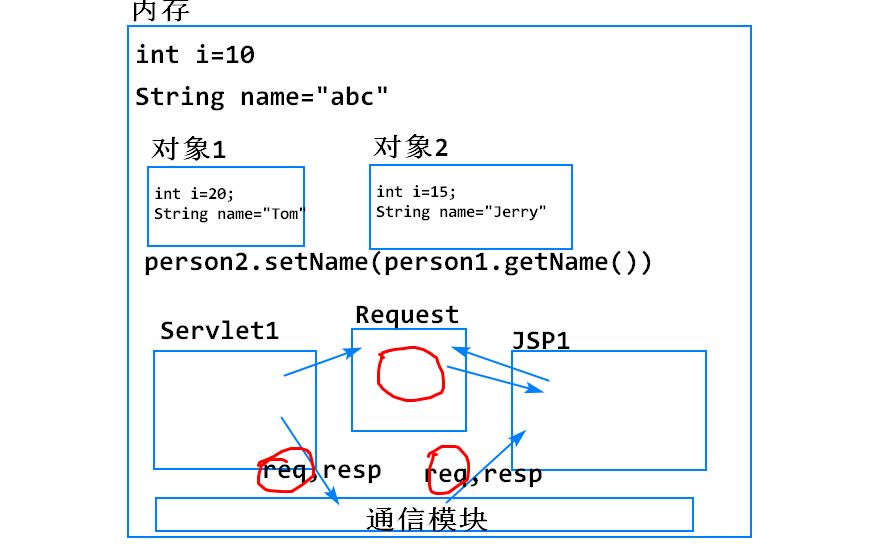
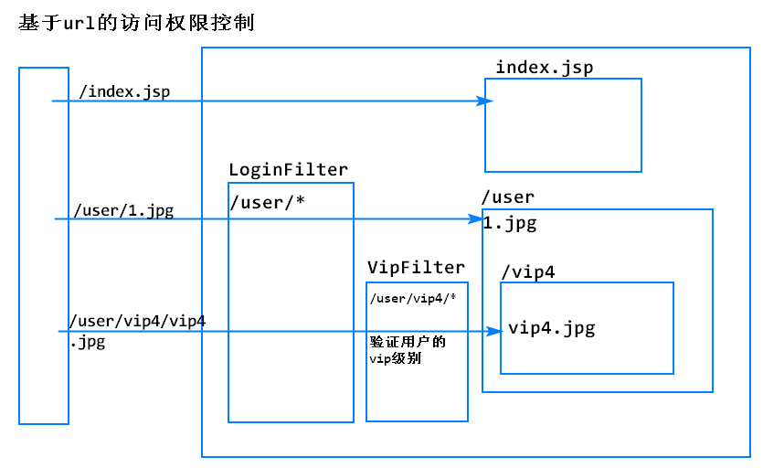
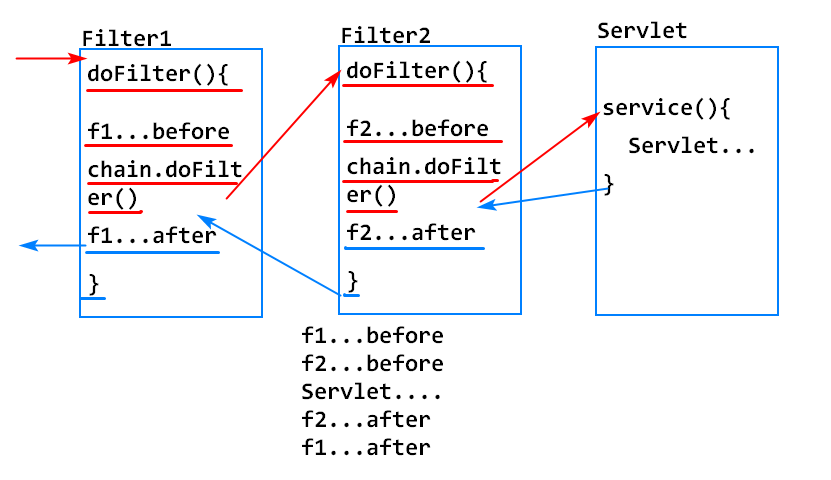
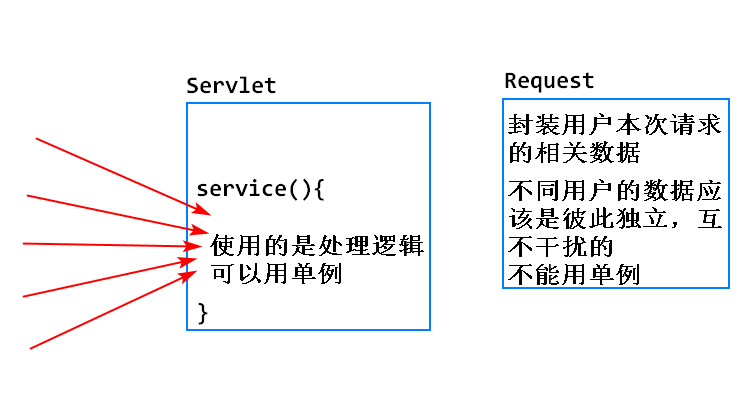
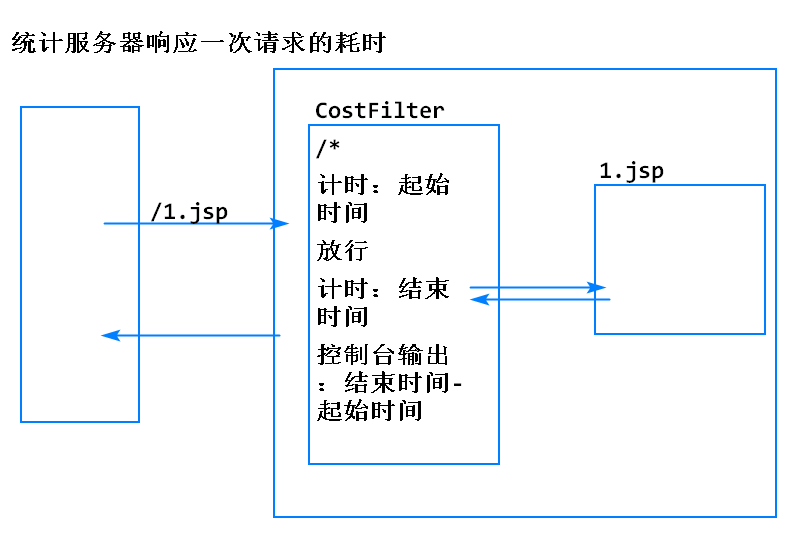
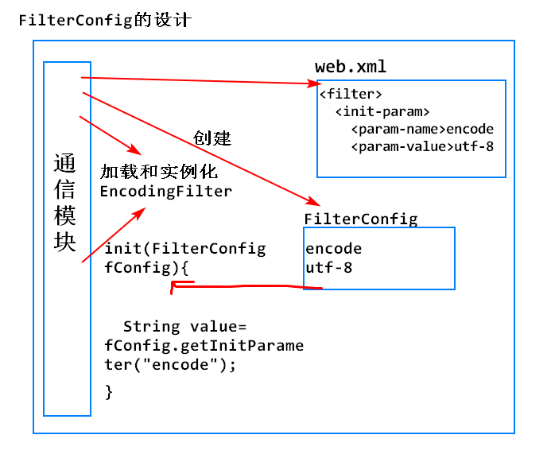
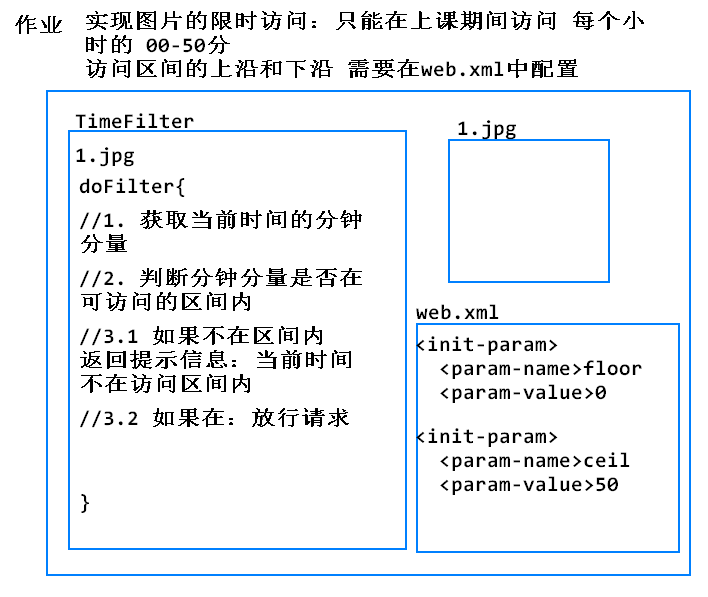

<!-- TOC -->
- [Session](#session)
    - [Session的原理](#session的原理)
    - [为什么用Session？](#为什么用session)
    - [怎么用？](#怎么用)
        - [案例: 使用Session](#案例-使用session)
    - [Session发挥作用依赖于Cookie](#session发挥作用依赖于cookie)
        - [案例: 统计用户的访问次数](#案例-统计用户的访问次数)
    - [Session和Request的区别](#session和request的区别)
    - [Session的销毁](#session的销毁)
    - [Cookie和Session的区别？](#cookie和session的区别)
- [Filter（过滤器）](#filter过滤器)
    - [如何开发一个过滤器](#如何开发一个过滤器)
        - [案例: 过滤图片](#案例-过滤图片)
    - [案例: 一个Filter拦截多个请求](#案例-一个filter拦截多个请求)
<!-- /TOC -->

## Session
是将会话状态保存在服务器的技术

###  Session的原理
1. 服务器为每个用户创建一个Session对象，保存该用户的会话状态
2. 服务器将该Session的id，通过JSESSIONID的Cookie发送给浏览器保存
3. 浏览器在后续的请求中，会自动携带JSESSIONID的Cookie，服务器通过该Cookie的值，找到用户对应的Session对象


### 为什么用Session？
1. 相对Cookie来说更安全
2. Session仅需要传输JSESSIONID的Cookie，不占用服务器的网络带宽
3. Session中的数据没有大小限制（如果内存空间不足以保存数据，会自动将数据保存在服务器的硬盘上）

### 怎么用？
```
// 返回该用户对应的Session对象
HttpSession session=request.getSession(boolean flag);
flag:true:  有则使用，无则创建
     false: 有则使用，无则返回null

HttpSession session=request.getSession();//等同于传入true

session.setAttribute(String name,Object value);
Object value=session.getAttribute(String name);
session.removeAttribute(String name);
```


#### 案例: 使用Session



1. 编写SessionDemo

> 记住用户的用户名

```
public class SessionDemo1 extends HttpServlet {
	private static final long serialVersionUID = 1L;

	protected void doGet(HttpServletRequest request, HttpServletResponse response) 
	throws ServletException, IOException {
		
		String name=request.getParameter("name");
		
		// 为用户创建一个Session对象,有则使用,无则创建
		HttpSession session=request.getSession(true);
		
		session.setAttribute("name", name);
		
		// 防止关闭浏览器导致Session失效
		// 手动发送一个JSESSIONID的Cookie,并设置maxAge
		Cookie cookie=new Cookie("JSESSIONID",session.getId());
		cookie.setMaxAge(60*30);// 30分钟
		cookie.setPath(request.getContextPath());
		response.addCookie(cookie);
		
		response.getWriter().write("success...");
	}
}
```

> 直接取名字,有名字则返回name,没有名字返回第一次访问

```
public class SessionDemo2 extends HttpServlet {
	private static final long serialVersionUID = 1L;
	
	protected void doGet(HttpServletRequest request, HttpServletResponse response) 
	throws ServletException, IOException {
		// 有则使用，无则返回null
		HttpSession session=request.getSession(false);
		
		if(session==null) {
			response.getWriter().write("first visit");
		}else {
			String name=(String)session.getAttribute("name");
			response.getWriter().write("name="+name);
		}
	}
}
```

2. 测试

	`localhost:8080/Servelt_v8.1/demo1?name=Tom`
	
	`localhost:8080/Servelt_v8.1/demo2`


### Session发挥作用依赖于Cookie
如果浏览器关闭，JSESSIONID的Cookie会被销毁，用户再次访问服务器时，服务器无法找到用户对应的Session对象

#### 案例: 统计用户的访问次数



```
public class CountServlet extends HttpServlet {
	private static final long serialVersionUID = 1L;

	protected void doGet(HttpServletRequest request, HttpServletResponse response) 
	throws ServletException, IOException {
		// 有则使用，无则创建
		HttpSession session=request.getSession();// 等同于getSession(true);
		
		Integer count=(Integer)session.getAttribute("count");
		
		if(count==null) {
			// 第一次
			count=1;
		}else {
			count++;
		}
		session.setAttribute("count", count);
		response.getWriter().write("count="+count);
	}
}
```


### Session和Request的区别

`request.setAttribute(String name,Object value);`

`session.setAttribute(String name,Object value);`

1. 可以利用Session在一次请求的内部去共享数据，比如Servlet共享数据给JSP
2. 但是Session存活的时间比Request久很多，存入Session中的数据不能得到及时的释放，会增加服务器内存的负担
3. 因此，仅需要在一次请求内部进行的数据共享，使用Request
4. 需要跨请求（在多次请求之间）实现的数据共享，使用Session




### Session的销毁

1. 超时
	1. 默认情况下，一个Session对象可以存活30分钟（从用户最后一次访问该Session开始算）
	2. 可以手动指定Session的存活时间，在web.xml文件中配置，单位是分钟\

		<session-config>
			<session-timeout>30</session-timeout>
		</session-config>

	3. 超时时间越长，用户体验越好，服务器内存压力越大
	4. 超时时间越短，用户体验越差，服务器内存压力越小

2. 马上销毁
```
// 马上销毁该Session
// session.invalidate();
// 常用于用户注销用例

public class DelSessionServlet extends HttpServlet {
	private static final long serialVersionUID = 1L;

	protected void doGet(HttpServletRequest request, HttpServletResponse response) 
	throws ServletException, IOException {
		
		HttpSession session=request.getSession(false);
		
		if(session!=null) {
			// 马上销毁当前Session对象
			session.invalidate();
		}
		response.getWriter().write("del success");
	}
}
```

3. Session的钝化和活化（了解）
	1. 当服务器正常关闭时，未超时的Session会被序列化到服务器的硬盘上保存，这个过程称为钝化
	2. 当服务器再次启动后，钝化的Session会被反序列化到内存中，继续发挥作用，这个过程称为活化


### Cookie和Session的区别？
1. Cookie是将会话状态保存在浏览器的技术
	1. Cookie中保存的数据时间可以比较久（例如30天）
	2. Cookie中数据的安全性和稳定性较差
	3. Cookie中的数据大小有限制，约4kb
2. Session是将会话状态保存在服务器的技术
	1. Session中保存的数据时间比较短（默认30分钟超时）
	2. Session中的数据的安全性和稳定性较高
	3. Session中的数据大小理论上没有限制


## Filter（过滤器）
1. 是Sun公司提供的一种特殊的组件，可以对用户的请求进行拦截，执行特定的功能
2. 常见的应用：过滤敏感词，访问权限控制，压缩响应内容



### 如何开发一个过滤器
1. 开发一个过滤器类，实现Filter接口
2. 重写Filter接口中定义的3个抽象方法
	1. init()
	2. destory()
	3. doFilter()：添加过滤器生效的逻辑
3. 在web.xml中配置一个Filter
```
<filter>
	<filter-name>
	<filter-class>
</filter>
<filter-mapping>
	<filter-name>
	<url-pattern>过滤器所拦截的url
</filter-mapping>
```

#### 案例: 过滤图片

> 在web.xml添加filter

```
<filter>
	<filter-name>ImgFilter</filter-name>
	<filter-class>filter.ImgFilter</filter-class>
</filter>
<filter-mapping>
	<filter-name>ImgFilter</filter-name>
	<url-pattern>/1.gif</url-pattern>
</filter-mapping>
```
> 检测是否过滤
```
public class ImgFilter implements Filter{

	public void init(FilterConfig filterConfig) throws ServletException {
		
	}

	public void doFilter(ServletRequest request, ServletResponse response, FilterChain chain)
			throws IOException, ServletException {
		
		System.out.println("Filter1...before");
		
		// 放行本次请求
		chain.doFilter(request, response);
		
		System.out.println("Filter1...after");
	}

	public void destroy() {
		
	}
}
```

### 案例: 一个Filter拦截多个请求
1. 新添加一组<filter-mapping>标签
2. 使用 * 作为通配符
	1. <url-pattern>/*</url-pattern>  拦截所有请求
	2. <url-pattern>/user/*</url-pattern> 拦截所有/user目录下的请求
> 创建jsp

> 在web.xml添加filter

```
<filter-mapping>
	<filter-name>ImgFilter</filter-name>
	<url-pattern>/1.jsp</url-pattern>
</filter-mapping>
 ```

### 多个过滤器配合使用
1. 多个Filter生效的顺序由 <filter-mapping>标签在web.xml中出现的顺序来决定
2. <filter-mapping>标签越靠前，Filter越优先生效




### Filter的生命周期
1. 分为4个阶段：创建、初始化、服务、销毁

2. 创建：服务器启动，即加载和实例化配置的所有Filter
 
3. 初始化：在实例化之后，马上调用Filter的init()方法，执行初始化的逻辑(由开发者来提供)

4. 服务：每当有请求和该Filter拦截的url一致时，服务器会调用该Filter的doFilter()方法，对请求进行拦截，该方法在整个生命周期中会被调用多次

5. 销毁：当服务器关闭或者当前Web应用被移出容器时，Filter会被销毁，销毁前服务器会调用它的destory()方法，执行销毁的逻辑（由开发者提供）

6. Servlet和Filter在整个项目运行阶段，都只有一个实例，不同请求是基于多线程访问同一个实例


#### 案例: 统计一次请求的耗时



```
public class CostFilter implements Filter {
	
	static {
		System.out.println("Filter被加载");
	}

    public CostFilter() {
    	System.out.println("Filter被实例化");
    }

    public void destroy() {
	}

    public void doFilter(ServletRequest request, ServletResponse response, FilterChain chain) 
    throws IOException, ServletException {
    	// 请求通过时进行计时
    	long st=System.currentTimeMillis();
    	
    	chain.doFilter(request, response);
    	
    	// 响应通过时进行计时
    	long et=System.currentTimeMillis();
    	
    	// 输出耗时
    	System.out.println("cost="+(et-st)+"ms");
	}

	public void init(FilterConfig fConfig) throws ServletException {
		System.out.println("Filter被初始化");
	}
}
```


###  FilterConfig
1. 封装了一个Filter在web.xml中配置的初始化参数的对象
2. 当服务器加载和实例化一个Filter时，会读取web.xml中该Filter的配置
3. 服务器会创建一个FilterConfig对象，封装读取到的配置信息
4. 服务器会在调用一个Filter的init()方法时，将FilterConfig对象传进来
5. 开发者仅需要调用FilterConfig对象的api,就可以直接拿到在web.xml中配置的参数



> 在web.xml中添加初始化参数

```
<filter>
    <display-name>EncodingFilter</display-name>
    <filter-name>EncodingFilter</filter-name>
    <filter-class>filter.EncodingFilter</filter-class>
	<!-- 为当前Filter配置一个初始化参数 -->
	<init-param>
		<param-name>encode</param-name>
		<param-value>utf-8</param-value>
	</init-param>
</filter>

String value=config.getInitParameter(String name);
```

#### 案例: 对所有网页处理文字编码问题
> 编写jsp

```
<%@ page pageEncoding="UTF-8"%>
<!DOCTYPE html PUBLIC "-//W3C//DTD HTML 4.01 Transitional//EN" "http://www.w3.org/TR/html4/loose.dtd">
<html>
<head>
<meta http-equiv="Content-Type" content="text/html; charset=ISO-8859-1">
<title>Insert title here</title>
</head>
<body>
	<form action="test" method="post">
		姓名：<input type="text" name="username"><br>
		<input type="submit" value="提交" >
	</form>
</body>
</html>
```
> 编写filter
```
public class EncodingFilter implements Filter {

	String encode = null;

	public void init(FilterConfig fConfig) throws ServletException {
		encode=fConfig.getInitParameter("encode");
	}

	public void doFilter(ServletRequest request, ServletResponse response, FilterChain chain)
	throws IOException, ServletException {
		// 处理请求乱码
		request.setCharacterEncoding(encode);

		// 处理响应乱码
		response.setContentType("text/html;charset="+encode);

		chain.doFilter(request, response);
	}

	public EncodingFilter() {
	}

	public void destroy() {
	}

}
```


#### 案例：实现图片的限时访问



> 编写filter

```
public class TimeFilter implements Filter {

	int floor;
	int ceil;
	
	public void init(FilterConfig fConfig) throws ServletException {
		floor=Integer.parseInt(fConfig.getInitParameter("floor"));
		ceil=Integer.parseInt(fConfig.getInitParameter("ceil"));
	}

	public void doFilter(ServletRequest request, ServletResponse response, FilterChain chain) 
	throws IOException, ServletException {
		// 实现图片的限时访问
		
		//1. 获取当前时间的分钟分量
		// 获取当前时间
		Calendar c=Calendar.getInstance();
		// 获取当前的分钟分量
		int minute=c.get(Calendar.MINUTE);
		
		//2. 判断分钟分量是否在可访问的区间内
		if(minute<floor || minute >ceil) {
			//3.1 如果不在，返回错误提示信息
			response.setContentType("text/html;charset=utf-8");
			response.getWriter().write("当前不是访问时间");
		}else {
			//3.2 如果在，放行
			chain.doFilter(request, response);
		}
	}
	
	public void destroy() {
	}
}
```

> 配置初始化参数

```
  <filter>
    <display-name>TimeFilter</display-name>
    <filter-name>TimeFilter</filter-name>
    <filter-class>filter.TimeFilter</filter-class>
    <init-param>
    	<param-name>floor</param-name>
    	<param-value>0</param-value>
    </init-param>
    <init-param>
    	<param-name>ceil</param-name>
    	<param-value>40</param-value>
    </init-param>
  </filter>
```
