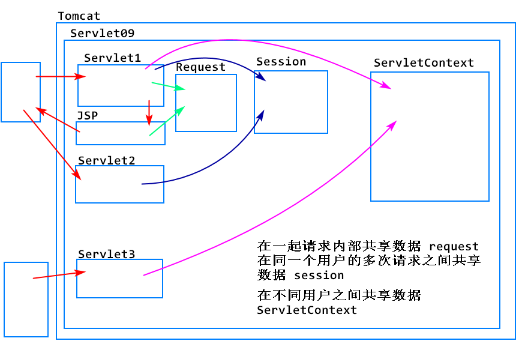

<!-- TOC -->
- [Web项目中的路径问题](#web项目中的路径问题)
- [ServletRequest和HttpServletRequest的关系](#servletrequest和httpservletrequest的关系)
- [JSP中的页面复用](#jsp中的页面复用)<br>
        - [案例: 过滤器](#案例-过滤器)
- [ServletContext (Servlet上下文)](#servletcontext-servlet上下文)
- [Listener（监听器）](#listener监听器)
<!-- /TOC -->

> 今天的任务：实现Emp功能的访问权限控制

实现Emp增删改查操作，必须登录后才能访问


##  Web项目中的路径问题
1. URL
	1. 统一资源定位符：用于唯一定位互联网上的一个资源
	2. 格式： 协议 :// 域名(ip) : 端口号 /项目路径/资源路径
		1. http ://  localhost : 8080 /Servlet09 /admin/listEmp
	3. http://localhost:8080 -> 浏览器使用


2.路径的2种写法
  1. 相对路径
    1. 从当前文件到目标文件的路径称为相对路径
    2. 当前文件位置不同，相对路径也不同
    3. 相对路径的写法： "css/style.css", "../css/style.css
    4. 相对路径不能拿来直接访问互联网上的资源，必须由浏览器拼接成完整的url，才能访问互联网上的资源
  
  2. 绝对路径
		1. 从一个固定位置到目标文件的路径称为绝对路径，一般是项目的根目录
		2. 当前文件位置对 绝对路径 没有影响
		3. 绝对路径要以  "/" 开头，或者"http://...."
    


3. 将页面中的相对路径都替换成绝对路径，可以有效避免404问题，但是当需要修改的地方比较多时，工作量较大


4. 可以利用html提供的base标签解决这一问题
```
<% 
  String path=request.getContextPath();
  // 动态生成basePath，后期路径变化，代码不用修改
    String basePath=request.getScheme()+"://"
                    +request.getServerName()+":"
                +request.getServerPort()+path+"/";
%>

<!-- 用于指定当前页面的父路径，供拼接路径使用 -->
<!-- 格式 href="协议://域名:端口号/项目路径/" -->
<base href="<%=basePath %>">
```

## ServletRequest和HttpServletRequest的关系
1. HttpServletRequest继承了ServletRequest
2. HttpServletRequest额外添加了一些处理http协议相关的方法
	1. request.getMethod(); // 获取用户的请求方式(7种，http)
	2. request.getSession();

3. HttpServletResponse继承了ServletResponse，添加了http协议相关的方法
	1. response.sendRedirect();//重定向


## JSP中的页面复用
1. 可以在一个jsp中引入另一个jsp中的内容
2. 这样可以实现页面的复用，提高项目的可维护性
3. 实现方式

		<%@ include file="要引入的jsp的路径" %>


#### 案例: 过滤器

1. 在限制页面.jsp内的href/src前加"<%=request.getContextPath() %>/

2. 在LoginServlet中添加
```
// 向Session中添加用户登录状态
request.getSession().setAttribute("user", username);
```
3. 创造LoginFilter, URL-pattern为: /admin/*
```
<!-- 引入header.jsp的内容 -->
<%@ include file="/WEB-INF/jsp/header.jsp" %
```


## ServletContext (Servlet上下文)
1. 可以理解为Servlet运行的背景（环境）
2. ServletContext指的就是Tomcat
3. 每当Tomcat加载完一个项目之后，会马上创建一个ServletContext对象，在内存中唯一代表该项目


1. 常用API

		在Servlet中获取ServletContext对象：
		ServletContext sc=getServletContext();
		ServletContext sc=request.getServletContext();
		ServletContext sc=getServletConfig().getServletContext();

		数据操作：
		sc.setAttribute(String name,Object value);
		Object value=sc.getAttribute(String name);
		sc.removeAttribute(String name);

2. 常用功能
	1. 可以在整个项目内部实现数据的共享，当前项目中所有组件都可以直接访问到同一个ServletContext对象
		1. ServletContext不能替代Session，因为所有用户访问的都是同一个ServletContext对象，不同用户保存的数据会彼此覆盖
		2. ServletContext中适合保存整个项目通用的一些数据，例如项目总的登录人数
		3. 如何选择：
			1. 数据是不同用户都相同，还是每个用户不同：相同->ServletContext
			2. 数据共享是否跨请求？跨请求->Session,不跨请求->Request


	2. 获取一个资源在服务器硬盘上的绝对路径
			// 相对webapp文件夹的路径
			String path=sc.getRealPath("相对路径");
			// 举例
			sc.getRealPath("1.jsp");
			sc.getRealPath("WEB-INF/web.xml");

## Listener（监听器）
1. 监听器中有2个核心的元素
	1. 具体的事件
	2. 事件发生后所执行的处理逻辑(开发者来提供)

2. JavaEE提供的监听器，可以对web运行中的多种事件进行监听，由开发者提供具体的事件处理逻辑
	1. 监听特殊对象被创建和被销毁
		1. Request对象
		2. Session对象
		3. ServletContext对象
	2. 监听特殊对象中存入了值、更新了值、删除了值
		1. Request对象
		2. Session对象
		3. ServletContext对象
	3. 其他

3. 如何开发一个监听器
	1. 开发一个类，实现对应的监听器接口
	2. 实现监听器接口定义的抽象方法，在对应的方法中添加具体时间的处理逻辑
	3. 在web.xml中配置该监听器


4. JavaEE的监听器的核心目的是让开发者可以参与到JavaEE的一些特殊的事件中，添加自定义的事件处理逻辑


